Here is the current state of all of my cameras. I need you to deeply over this and reason about the optimal settings that I should use. 

Context: 

- -P0 cameras are important to me and I want the detect stream running at the maximum resolution the camera supports in order for LPR and face detect to have the best chance at recognition. 

- -P1 cameras are considered part of my security perimeter so it's important that person detect is reliable, but we don't need to be running at maximum detect resolution for that to function. 

- -P2 cameras are just useful, but don't really factor into my security perimeter, therefore detect can run at the lowest resolution. - I want the Panoramic cameras to run detect on a 16x9 sub-stream (I think 1080p is supported on one of their sub-streams?) so that objects aren't distorted. - I really only care about camera FPS for the record stream. I think 10fps is fine for recordings? 

- -I've had this system fully operational previously with much much better detect FPS and lower inference latency on these two GPUs, so I know we can get the right settings to achieve this. I'm not sure which direction we need to push to get there. 

- -I want to ensure we have the same camera settings by model across all cameras. I want to try to push for consistency across the fleet where possible. Obviously the resolutions and settings of the streams might vary based on if I have declared a cameras as P0/P1/P2. 

- -Use your vision capabilities to analyze the scene of each camera (JPGs attached) and ensure your recommendations align with your observations.

- -Goal is very low latency detection to feed home assistant automations via MQTT based on occupancy of cars and people.

# Camera Fleet Documentation

**Generated:** 2026-01-03 11:33:11
**Frigate Version:** 0.17.0-430cebe
**Total Cameras:** 38
**Scene Analysis:** GPT-4.1 Vision API (38/38 cameras)

## Table of Contents

1. [System Summary](#system-summary)
2. [Camera Models](#camera-models)
3. [Frigate Stream Role Mapping](#frigate-stream-role-mapping)
4. [Problematic Cameras (High Skip Ratio)](#cameras-with-skip-ratio--0)
5. [Individual Camera Details](#individual-camera-details)
   - Each camera includes: Network info, encoder settings, and AI-generated scene analysis

---

## System Summary

### Detector Metrics

| Detector | Inference Speed | Model Type |
|----------|-----------------|------------|
| onnx_0 | 15.58ms | ONNX TensorRT (Frigate+) |
| onnx_1 | 16.82ms | ONNX TensorRT (Frigate+) |

### Detection Summary

- **Detection Enabled:** 33 cameras
- **Detection Disabled:** 5 cameras
  - `greenhouse_1`
  - `greenhouse_2`
  - `skycam_east`
  - `skycam_west`
  - `storageyard_powerwall`
- **Global Detect FPS:** 1 (reduced from 5 for GPU load management)

### Cameras with Skip Ratio > 0%

⚠️ These cameras are experiencing frame skipping, indicating potential GPU or decoder overload:

| Camera | Camera FPS | Skipped FPS | Skip % | Priority |
|--------|------------|-------------|--------|----------|
| driveway_gate | 1.0 | 0.5 | 50% | P0 |
| frontyard_1 | 1.0 | 0.7 | 70% | P0 |
| frontyard_circle_driveway | 1.0 | 0.6 | 60% | P0 |
| frontyard_circle_driveway_2 | 1.1 | 0.9 | 82% | P0 |
| panorama_cir_gate | 1.0 | 0.2 | 20% | P0 |
| patio_1 | 1.1 | 0.3 | 27% | P1 |
| patio_2 | 1.1 | 0.8 | 73% | P0 |
| pool_2 | 1.0 | 0.7 | 70% | P0 |
| southyard_1 | 1.0 | 0.5 | 50% | P0 |
| southyard_3 | 1.0 | 0.2 | 20% | P2 |

---

## Camera Models

| Model | Count | Main Resolution | Stream Count |
|-------|-------|-----------------|--------------|
| IP8M-2496E-V2 | 24 | 3840x2160 | 2-3 streams |
| IP8M-2796E-AI | 2 | 3840x2160 | 2-3 streams |
| IP8M-DLB2998EW-AI | 6 | 4096x1856 | 2-3 streams |
| IP8M-MB2546E | 4 | 3840x2160 | 2-3 streams |
| IP8M-MT2544E | 1 | 3840x2160 | 2-3 streams |
| IP8M-T2599EW-AI-V3 | 1 | 3840x2160 | 2-3 streams |

### Model Notes

- **IP8M-2496E-V2**: Standard 4K bullet camera (most common)
- **IP8M-2796E-AI**: 4K AI-enabled bullet with on-camera analytics
- **IP8M-DLB2998EW-AI**: Dual-lens 8MP AI camera (4096x1856 panoramic)
- **IP8M-MB2546E**: 4K mini-bullet camera (12fps max)
- **IP8M-MT2544E**: 4K turret camera with audio
- **IP8M-T2599EW-AI-V3**: AI-enabled turret with full-color night vision

---

## Frigate Stream Role Mapping

All cameras use consistent RTSP stream assignment via go2rtc:

| Frigate Role | RTSP Subtype | Typical Resolution | Usage |
|--------------|--------------|-------------------|-------|
| **record** | subtype=0 (Main) | 3840x2160 @ 15fps | 4K recording via CUDA hw accel |
| **detect** | subtype=1 (Sub1) | 640-704x480 @ 5fps | Object detection (GPU downsampled to 1fps) |
| **live** | subtype=0 (Main) | 3840x2160 @ 15fps | WebRTC live view via go2rtc |

### RTSP URL Patterns

```
Main stream (record/live): rtsp://{user}:{pass}@{ip}:554/cam/realmonitor?channel=1&subtype=0
Sub stream (detect):       rtsp://{user}:{pass}@{ip}:554/cam/realmonitor?channel=1&subtype=1
```

---

## Individual Camera Details

### backyard_1

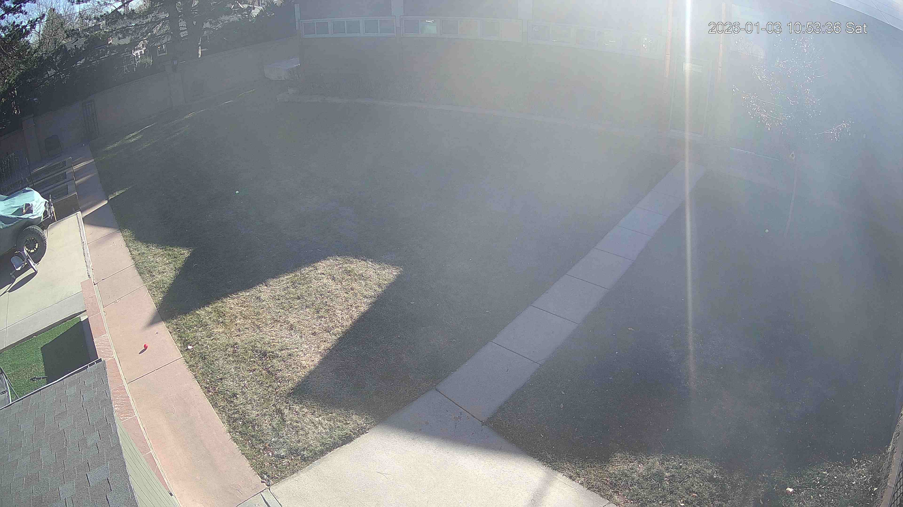

| Property | Value |
|----------|-------|
| **IP Address** | 192.168.20.232 |
| **Model** | IP8M-2496E-V2 |
| **Priority** | P2 |
| **Detection** | ✅ Enabled |

**Frigate Runtime:** ✅ camera_fps=1.1, process_fps=1.0, skipped=0.0 (0%), detection_fps=1.0

#### Encoder Configuration (from Amcrest API)

| Stream | Resolution | FPS | Bitrate | Codec | GOP | Enabled |
|--------|------------|-----|---------|-------|-----|---------|
| Main (Day) | 3840x2160 | 15 | 8192 kbps | H.264 | 15 | ✅ |
| Main (Night) | 3840x2160 | 15 | 8192 kbps | H.264 | 15 | ✅ |
| Sub1 (Day) | 704x480 | 5 | 512 kbps | H.264 | 5 | ✅ |
| Sub1 (Night) | 1280x720 | - | 1024 kbps | H.264 | - | ❌ |
| Sub2 (Day) | 704x480 | - | 1024 kbps | H.264 | - | ❌ |

**Video Color:** Brightness=50, Contrast=50, Saturation=50, Gamma=50, Hue=50, Style=Standard

**Exposure Settings:** Mode=Auto, WhiteBalance=Auto, DayNight=Auto, Backlight=Off

#### Scene Analysis

**Overview:** a large backyard area with good coverage of key access points (gates, walkways, driveway). The main limitations are sun glare and deep shadows, which may hinder detection and identification at certain times. Strategic lighting and possible camera adjustments could enhance overall security coverage.

**Camera Position:** The camera appears to be mounted at a high elevation, likely on the exterior wall or eave of a house/building, angled downward for a bird’s-eye view.

**Field of View:** Wide-angle coverage; most of the backyard is visible, including side paths and lawn. **Blind spots:** Sun glare in the upper right quadrant significantly reduces visibility.; Shadows from trees/buildings obscure some ground details.

**Entry/Exit Points:** Gate in the rear wall/fence ; Walkway leading to a door or entrance at the building 

**Priority Detection Zones:** Walkway leading to the building entrance ; Gate in the rear wall/fence ; Driveway/paved area 

**Security Assessment:** Good. Recommendations: Adjust camera angle or add a sun shield to reduce glare


---

### backyard_2

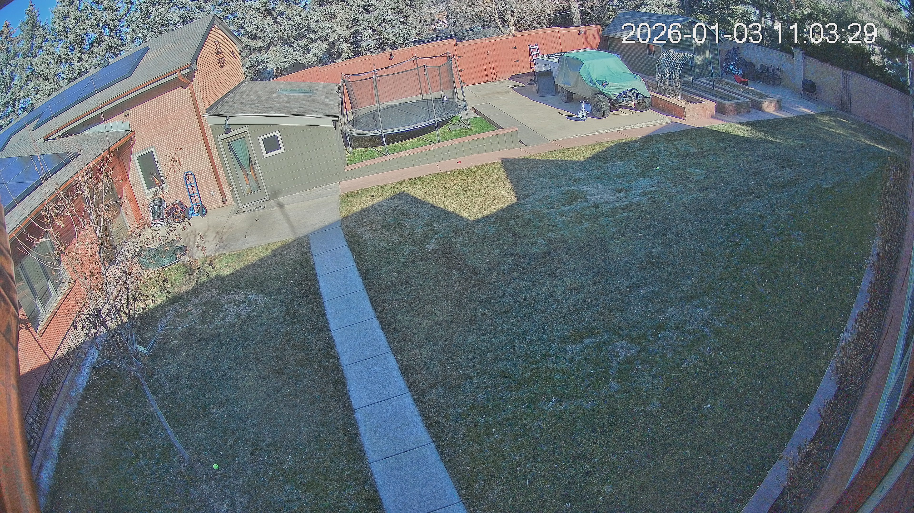

| Property | Value |
|----------|-------|
| **IP Address** | 192.168.20.132 |
| **Model** | IP8M-2796E-AI |
| **Priority** | P2 |
| **Detection** | ✅ Enabled |

**Frigate Runtime:** ✅ camera_fps=1.0, process_fps=1.1, skipped=0.0 (0%), detection_fps=1.4

#### Encoder Configuration (from Amcrest API)

| Stream | Resolution | FPS | Bitrate | Codec | GOP | Enabled |
|--------|------------|-----|---------|-------|-----|---------|
| Main (Day) | 3840x2160 | 15 | 8192 kbps | H.264 | 15 | ✅ |
| Main (Night) | 3840x2160 | 15 | 8192 kbps | H.264 | 15 | ✅ |
| Sub1 (Day) | 640x480 | 5 | 384 kbps | H.264 | 5 | ✅ |
| Sub1 (Night) | 1280x720 | 5 | 2048 kbps | H.264 | 10 | ✅ |
| Sub2 (Day) | 704x480 | - | 512 kbps | H.264 | - | ❌ |

**Video Color:** Brightness=50, Contrast=50, Saturation=50, Gamma=50, Hue=50, Style=Standard

**Exposure Settings:** Mode=Auto, WhiteBalance=Auto, DayNight=Auto, Backlight=Off

#### Scene Analysis

**Overview:** backyard_2" camera offers wide, high-angle coverage of the backyard, monitoring all major access points, play areas, and vehicle storage. The setup is strong for general security, with minor blind spots at the yard’s extreme edges. Strategic lighting and detection zone adjustments will further enhance security effectiveness.

**Camera Position:** The camera appears to be mounted high on the exterior of the house, possibly under the eaves or on a second-story wall, facing outward toward the backyard.

**Field of View:** Wide angle; the camera covers nearly the entire backyard, including the lawn, patio, driveway, and some of the rear and side fences. **Blind spots:** The far left edge (along the house wall) is not fully visible.

**Entry/Exit Points:** Back door from the house; Door on the shed/garage; Potential gate in the wooden fence; Concrete walkway

**Priority Detection Zones:** Back door and shed/garage door; Walkway and patio area; Driveway/parking pad

**Security Assessment:** Excellent. Recommendations: Ensure nighttime visibility with adequate lighting or infrared capability; Adjust detection zones to minimize false alarms from vegetation movement


---

### backyard_breezeway_rear

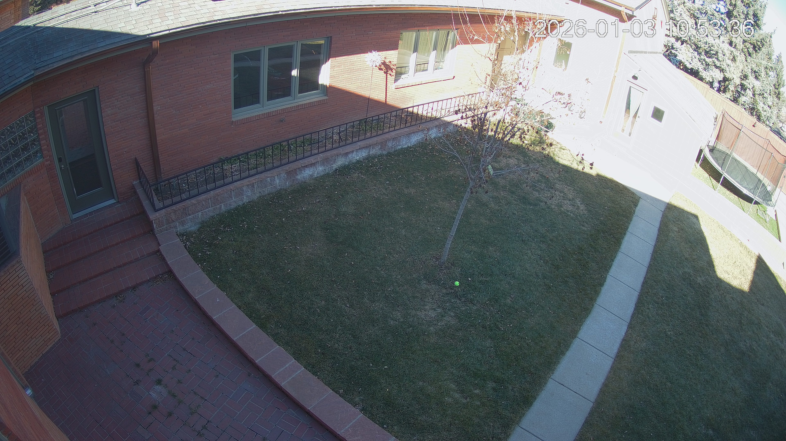

| Property | Value |
|----------|-------|
| **IP Address** | 192.168.20.8 |
| **Model** | IP8M-2796E-AI |
| **Priority** | P2 |
| **Detection** | ✅ Enabled |

**Frigate Runtime:** ✅ camera_fps=1.1, process_fps=1.0, skipped=0.0 (0%), detection_fps=0.7

#### Encoder Configuration (from Amcrest API)

| Stream | Resolution | FPS | Bitrate | Codec | GOP | Enabled |
|--------|------------|-----|---------|-------|-----|---------|
| Main (Day) | 3840x2160 | 15 | 6144 kbps | H.264 | 15 | ✅ |
| Main (Night) | 3840x2160 | 15 | 6144 kbps | H.264 | 15 | ✅ |
| Sub1 (Day) | 640x480 | 5 | 384 kbps | H.264 | 5 | ✅ |
| Sub1 (Night) | 1280x720 | 5 | 2048 kbps | H.264 | 10 | ✅ |
| Sub2 (Day) | 704x480 | - | 512 kbps | H.264 | - | ❌ |

**Video Color:** Brightness=50, Contrast=50, Saturation=50, Gamma=50, Hue=50, Style=Standard

**Exposure Settings:** Mode=Auto, WhiteBalance=Auto, DayNight=Auto, Backlight=Off

#### Scene Analysis

**Overview:** monitors the backyard breezeway, capturing key access points and the majority of the yard. Some minor blind spots and low-light areas could be addressed for optimal security coverage.

**Camera Position:** The camera appears to be mounted high on the rear exterior wall of a house, likely under the eaves or soffit.

**Field of View:** Wide angle, capturing a broad swath of the backyard, including the breezeway, lawn, and a secondary structure. **Blind spots:** The area directly below the camera (base of steps) is a potential blind spot.; Shadows from the house create some low-visibility zones.

**Entry/Exit Points:** Rear door to the house; Door to the outbuilding/shed; Walkway leading to/from the yard; The walkway may connect to a side or rear gate 

**Priority Detection Zones:** Rear door and steps; Walkway; Door to outbuilding/shed

**Security Assessment:** Good


---

### backyard_shed_corner

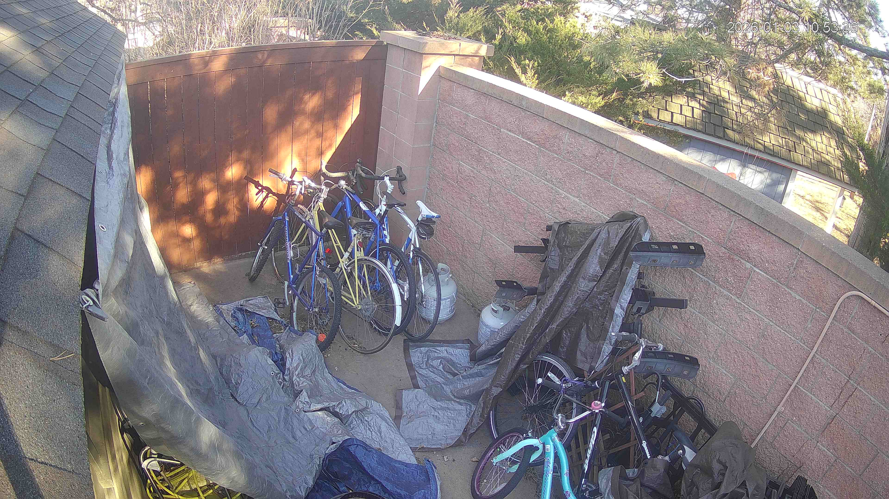

| Property | Value |
|----------|-------|
| **IP Address** | 192.168.20.79 |
| **Model** | IP8M-2496E-V2 |
| **Priority** | P2 |
| **Detection** | ✅ Enabled |

**Frigate Runtime:** ✅ camera_fps=1.1, process_fps=1.0, skipped=0.0 (0%), detection_fps=3.1

#### Encoder Configuration (from Amcrest API)

| Stream | Resolution | FPS | Bitrate | Codec | GOP | Enabled |
|--------|------------|-----|---------|-------|-----|---------|
| Main (Day) | 3840x2160 | 15 | 6144 kbps | H.264 | 15 | ✅ |
| Main (Night) | 3840x2160 | 15 | 6144 kbps | H.264 | 15 | ✅ |
| Sub1 (Day) | 704x480 | 5 | 512 kbps | H.264 | 5 | ✅ |
| Sub1 (Night) | 1280x720 | - | 1024 kbps | H.264 | - | ❌ |
| Sub2 (Day) | 704x480 | - | 1024 kbps | H.264 | - | ❌ |

**Video Color:** Brightness=50, Contrast=50, Saturation=50, Gamma=50, Hue=50, Style=Standard

**Exposure Settings:** Mode=Auto, WhiteBalance=Auto, DayNight=Auto, Backlight=Off

#### Scene Analysis

**Overview:** camera is well-positioned to monitor a secure storage corner in the backyard, focusing on bikes, propane tanks, and a gate/fence. It is effective for daytime monitoring but may need lighting and additional angles for complete security, especially at night or in blind spots.

**Camera Position:** The camera appears to be mounted high on the corner of a shed or building, likely near the roofline.

**Field of View:** - **Angle:** Medium to wide, covering the entire corner but not extending far beyond the walls. **Blind spots:** Directly beneath the camera (immediately below the mounting point).; Areas obscured by tarps or large objects.

**Entry/Exit Points:** Wooden gate/fence in the rear left corner ; No doors or other gates directly visible in the frame; The shed/building door is not in view

**Security Assessment:** Good. Recommendations: Install motion-activated lighting for better night visibility


---

### backyard_storageyard_gate

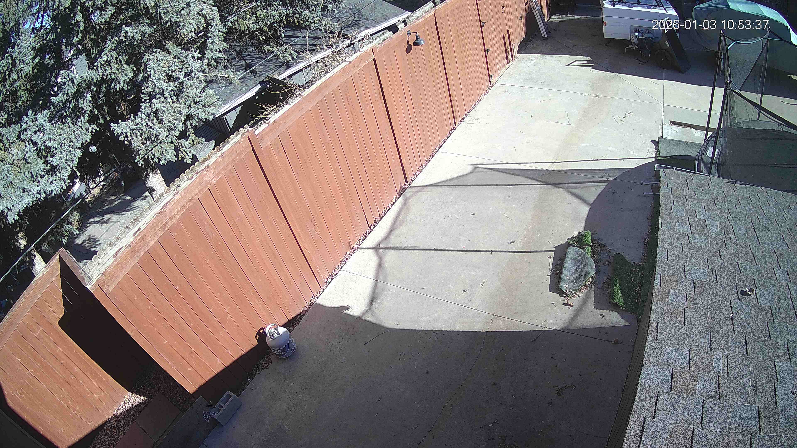

| Property | Value |
|----------|-------|
| **IP Address** | 192.168.20.101 |
| **Model** | IP8M-2496E-V2 |
| **Priority** | P2 |
| **Detection** | ✅ Enabled |

**Frigate Runtime:** ✅ camera_fps=1.0, process_fps=1.0, skipped=0.0 (0%), detection_fps=2.1

#### Encoder Configuration (from Amcrest API)

| Stream | Resolution | FPS | Bitrate | Codec | GOP | Enabled |
|--------|------------|-----|---------|-------|-----|---------|
| Main (Day) | 3840x2160 | 15 | 6144 kbps | H.264 | 15 | ✅ |
| Main (Night) | 3840x2160 | 15 | 6144 kbps | H.264 | 15 | ✅ |
| Sub1 (Day) | 704x480 | 5 | 512 kbps | H.264 | 5 | ✅ |
| Sub1 (Night) | 1280x720 | - | 1024 kbps | H.264 | - | ❌ |
| Sub2 (Day) | 704x480 | - | 1024 kbps | H.264 | - | ❌ |

**Video Color:** Brightness=50, Contrast=50, Saturation=50, Gamma=50, Hue=50, Style=Standard

**Exposure Settings:** Mode=Auto, WhiteBalance=Auto, DayNight=Auto, Backlight=Off

#### Scene Analysis

**Overview:** broad coverage of a backyard storage yard, focusing on the main gate and driveway access. It is well-positioned for monitoring entry/exit and general activity, but would benefit from supplementary coverage in the shadowed and obstructed areas for optimal security.

**Camera Position:** The camera is mounted at a high elevation, likely on the upper corner of a building or structure, angled downward to cover the yard area.

**Field of View:** Wide angle; the camera captures a large portion of the backyard/storage yard, including the gate area and driveway. **Blind spots:** The right edge of the frame is partially blocked by the building’s roof.; The bottom left corner is shadowed and may obscure small objects or activity.

**Priority Detection Zones:** Main gate : Monitor for entry/exit; Walkway along the fence; **Areas to Mask:**

**Security Assessment:** Good


---

### backyard_suite_sidewalk_1

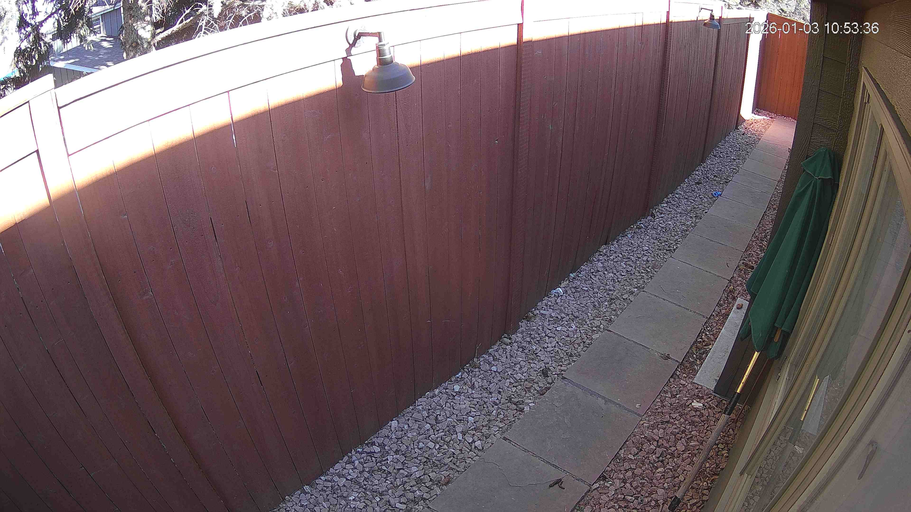

| Property | Value |
|----------|-------|
| **IP Address** | 192.168.20.176 |
| **Model** | IP8M-2496E-V2 |
| **Priority** | P2 |
| **Detection** | ✅ Enabled |

**Frigate Runtime:** ✅ camera_fps=1.0, process_fps=1.0, skipped=0.0 (0%), detection_fps=1.0

#### Encoder Configuration (from Amcrest API)

| Stream | Resolution | FPS | Bitrate | Codec | GOP | Enabled |
|--------|------------|-----|---------|-------|-----|---------|
| Main (Day) | 3840x2160 | 15 | 6144 kbps | H.264 | 15 | ✅ |
| Main (Night) | 3840x2160 | 15 | 6144 kbps | H.264 | 15 | ✅ |
| Sub1 (Day) | 704x480 | 5 | 512 kbps | H.264 | 5 | ✅ |
| Sub1 (Night) | 1280x720 | - | 1024 kbps | H.264 | - | ❌ |
| Sub2 (Day) | 704x480 | - | 1024 kbps | H.264 | - | ❌ |

**Video Color:** Brightness=50, Contrast=50, Saturation=50, Gamma=50, Hue=50, Style=Standard

**Exposure Settings:** Mode=Auto, WhiteBalance=Auto, DayNight=Auto, Backlight=Off

#### Scene Analysis

**Overview:** monitors a narrow side yard or access corridor between a building and a fence, with a clear view of the main gate and the entire walkway. It is well-positioned for detecting and recording any movement along this route, making it a valuable security asset for monitoring side access to the property.


---

### backyard_suite_sidewalk_2

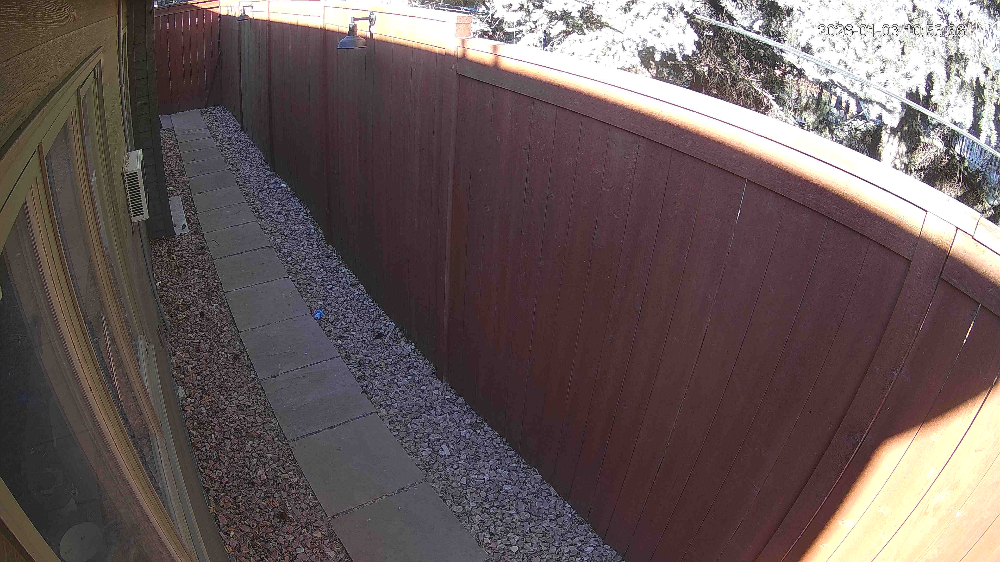

| Property | Value |
|----------|-------|
| **IP Address** | 192.168.20.181 |
| **Model** | IP8M-2496E-V2 |
| **Priority** | P2 |
| **Detection** | ✅ Enabled |

**Frigate Runtime:** ✅ camera_fps=1.0, process_fps=1.1, skipped=0.0 (0%), detection_fps=1.1

#### Encoder Configuration (from Amcrest API)

| Stream | Resolution | FPS | Bitrate | Codec | GOP | Enabled |
|--------|------------|-----|---------|-------|-----|---------|
| Main (Day) | 3840x2160 | 15 | 6144 kbps | H.264 | 15 | ✅ |
| Main (Night) | 3840x2160 | 15 | 6144 kbps | H.264 | 15 | ✅ |
| Sub1 (Day) | 704x480 | 5 | 512 kbps | H.264 | 5 | ✅ |
| Sub1 (Night) | 1280x720 | - | 1024 kbps | H.264 | - | ❌ |
| Sub2 (Day) | 704x480 | - | 1024 kbps | H.264 | - | ❌ |

**Video Color:** Brightness=50, Contrast=50, Saturation=50, Gamma=50, Hue=50, Style=Standard

**Exposure Settings:** Mode=Auto, WhiteBalance=Auto, DayNight=Auto, Backlight=Off

#### Scene Analysis

**Overview:** camera is well-positioned to monitor a narrow side yard or service walkway between a building and a fence, focusing on the sidewalk and gate. It provides good coverage for detecting movement along the path and at the gate, with minor blind spots near the building wall and directly below the camera. Enhanced lighting and a secondary camera at the gate would further improve security.

**Camera Position:** The camera is mounted on the exterior wall of a building, likely at a height of 7-9 feet.

**Field of View:** The camera has a **narrow to medium** angle, optimized for monitoring a linear path rather than a wide area.

**Security Assessment:** Good. Recommendations: Add a secondary camera at the gate for direct coverage of entry/exit


---

### backyard_wall_sidewalk

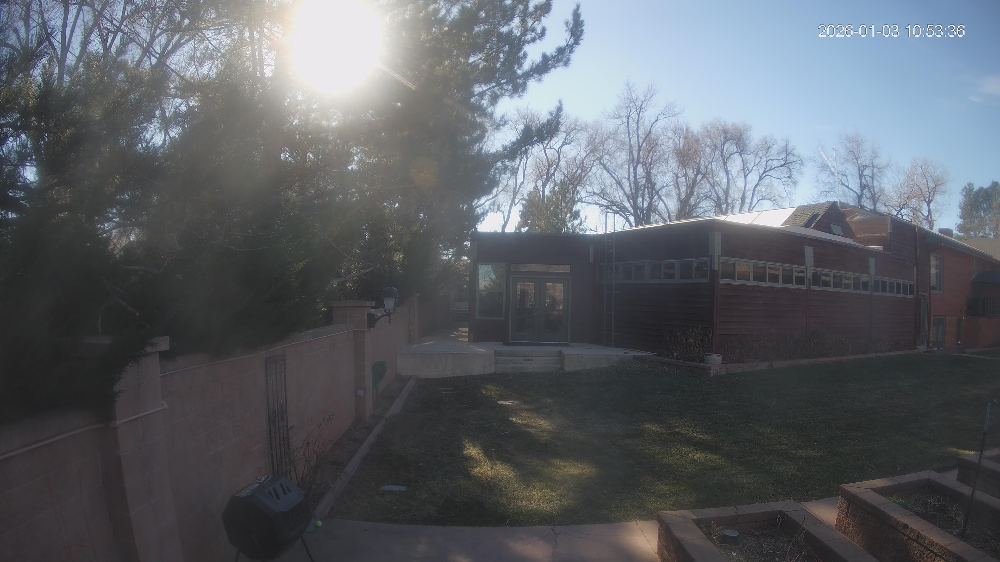

| Property | Value |
|----------|-------|
| **IP Address** | 192.168.20.122 |
| **Model** | IP8M-MB2546E |
| **Priority** | P2 |
| **Detection** | ✅ Enabled |

**Frigate Runtime:** ✅ camera_fps=1.0, process_fps=1.1, skipped=0.0 (0%), detection_fps=1.4

#### Encoder Configuration (from Amcrest API)

| Stream | Resolution | FPS | Bitrate | Codec | GOP | Enabled |
|--------|------------|-----|---------|-------|-----|---------|
| Main (Day) | 3840x2160 | 12 | 6144 kbps | H.264 | 12 | ✅ |
| Main (Night) | 3840x2160 | 12 | 6144 kbps | H.264 | 12 | ✅ |
| Sub1 (Day) | 704x480 | 5 | 512 kbps | H.264 | 5 | ✅ |
| Sub1 (Night) | 1280x720 | 5 | 1024 kbps | H.264 | 5 | ✅ |
| Sub2 (Day) | 352x240 | 15 | 0 kbps | H.264 | 30 | ✅ |

**Video Color:** Brightness=50, Contrast=50, Saturation=50, Gamma=50, Hue=50, Style=Standard

**Exposure Settings:** Mode=Auto, WhiteBalance=Auto, DayNight=Auto, Backlight=Off

#### Scene Analysis

**Overview:** a solid overview of the backyard wall and sidewalk, monitoring key access points such as the rear entrance and side gate. The main limitations are sun glare and potential blind spots near the wall and under the trees. With minor adjustments, the coverage can be further optimized for security.

**Camera Position:** The camera appears to be mounted at a height of approximately 7–9 feet, likely on a wall or pole at the edge of the backyard.

**Field of View:** Medium-wide angle; covers the length of the wall, the adjacent sidewalk, and the rear entrance to the house. **Blind spots:** The left side is partially obscured by dense trees and sun glare.; The far right and immediate area below the camera may not be fully visible.

**Entry/Exit Points:** Rear double doors; Metal gate in the wall

**Priority Detection Zones:** Rear entrance doors; Sidewalk/pathway along the wall; Metal gate in the wall

**Security Assessment:** Good. Recommendations: Address sun glare with a sun shield or repositioning


---

### backyard_workshop_door

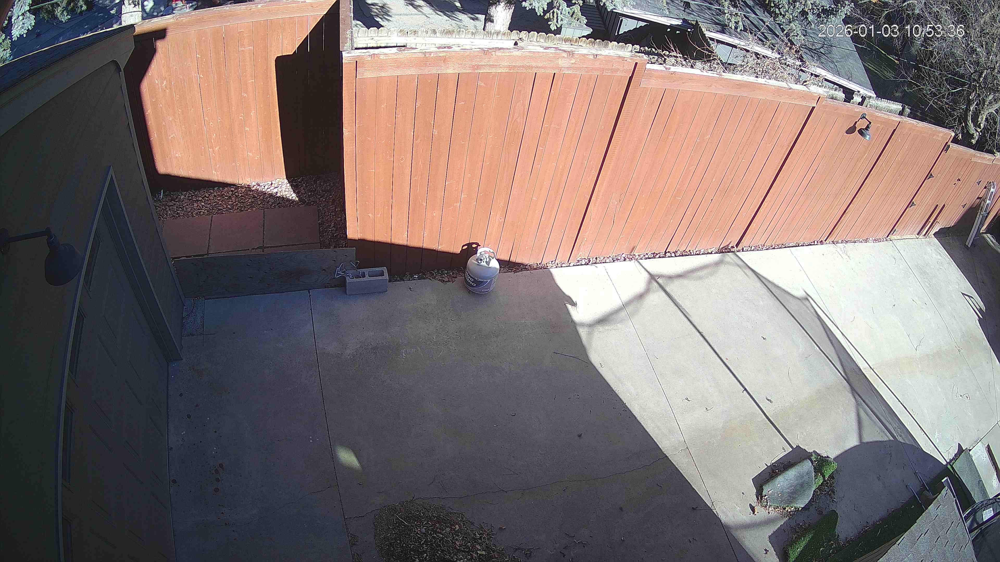

| Property | Value |
|----------|-------|
| **IP Address** | 192.168.20.250 |
| **Model** | IP8M-2496E-V2 |
| **Priority** | P2 |
| **Detection** | ✅ Enabled |

**Frigate Runtime:** ✅ camera_fps=1.0, process_fps=1.1, skipped=0.0 (0%), detection_fps=1.4

#### Encoder Configuration (from Amcrest API)

| Stream | Resolution | FPS | Bitrate | Codec | GOP | Enabled |
|--------|------------|-----|---------|-------|-----|---------|
| Main (Day) | 3840x2160 | 15 | 8192 kbps | H.264 | 15 | ✅ |
| Main (Night) | 3840x2160 | 15 | 8192 kbps | H.264 | 15 | ✅ |
| Sub1 (Day) | 704x480 | 5 | 512 kbps | H.264 | 5 | ✅ |
| Sub1 (Night) | 1280x720 | - | 1024 kbps | H.264 | - | ❌ |
| Sub2 (Day) | 704x480 | - | 1024 kbps | H.264 | - | ❌ |

**Video Color:** Brightness=50, Contrast=50, Saturation=50, Gamma=50, Hue=50, Style=Standard

**Exposure Settings:** Mode=Auto, WhiteBalance=Auto, DayNight=Auto, Backlight=Off

#### Scene Analysis

**Overview:** solid coverage of the backyard area immediately outside a workshop door, focusing on the patio and the main access path to a fenced gate. It is well-positioned for monitoring entry/exit activity but could benefit from supplemental coverage to eliminate shadowed blind spots and improve visibility at night.

**Camera Position:** The camera is mounted high on the exterior wall of a building (likely a workshop or shed), angled downward.

**Field of View:** Medium angle; focuses primarily on the patio and immediate entry area, with some coverage of the fence line. **Blind spots:** The area directly below the camera (door threshold) is not fully visible.; The far right edge, past the fence gate, is not covered.

**Priority Detection Zones:** Area directly in front of the workshop door; Pathway from the door to the fence gate; Fence gate itself 

**Security Assessment:** Good


---

### driveway_1

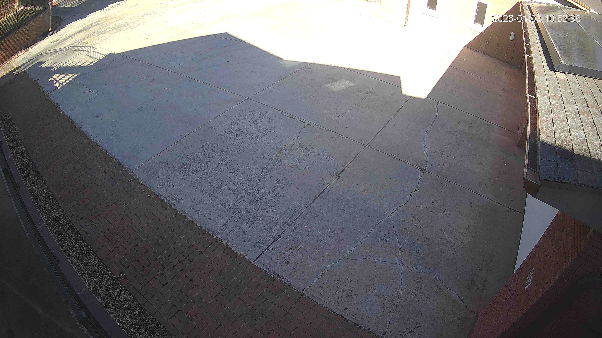

| Property | Value |
|----------|-------|
| **IP Address** | 192.168.20.131 |
| **Model** | IP8M-2496E-V2 |
| **Priority** | P0 |
| **Detection** | ✅ Enabled |

**Frigate Runtime:** ✅ camera_fps=1.1, process_fps=1.0, skipped=0.0 (0%), detection_fps=1.7

#### Encoder Configuration (from Amcrest API)

| Stream | Resolution | FPS | Bitrate | Codec | GOP | Enabled |
|--------|------------|-----|---------|-------|-----|---------|
| Main (Day) | 3840x2160 | 15 | 8192 kbps | H.264 | 15 | ✅ |
| Main (Night) | 3840x2160 | 15 | 8192 kbps | H.264 | 15 | ✅ |
| Sub1 (Day) | 704x480 | 5 | 512 kbps | H.264 | 5 | ✅ |
| Sub1 (Night) | 1280x720 | - | 1024 kbps | H.264 | - | ❌ |
| Sub2 (Day) | 704x480 | - | 1024 kbps | H.264 | - | ❌ |

**Video Color:** Brightness=50, Contrast=50, Saturation=50, Gamma=50, Hue=50, Style=Standard

**Exposure Settings:** Mode=Auto, WhiteBalance=Auto, DayNight=Auto, Backlight=Off

#### Scene Analysis

**Overview:** comprehensive coverage of a large driveway area, monitoring vehicle and pedestrian access. The camera is well-positioned for general surveillance, but additional coverage and lighting could further enhance security, particularly for building entrances and shadowed zones.

**Camera Position:** The camera appears to be mounted at a high elevation, likely on the exterior wall or eaves of a building, angled downward.

**Field of View:** Wide angle, capturing a large portion of the driveway, adjacent walkway, and a section of the building. **Blind spots:** The area immediately beneath the camera (bottom right corner) is not visible.; Shadows from the building and roof create some low-visibility zones.

**Priority Detection Zones:** **Areas to Mask:**

**Security Assessment:** Good


---

### driveway_breezeway

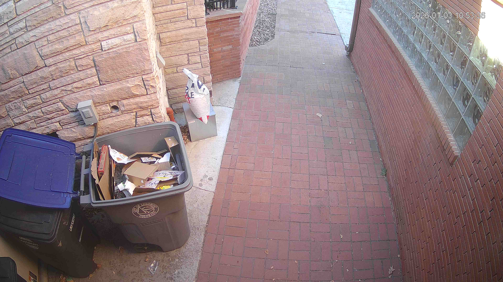

| Property | Value |
|----------|-------|
| **IP Address** | 192.168.20.114 |
| **Model** | IP8M-2496E-V2 |
| **Priority** | P1 |
| **Detection** | ✅ Enabled |

**Frigate Runtime:** ✅ camera_fps=1.0, process_fps=1.0, skipped=0.0 (0%), detection_fps=0.1

#### Encoder Configuration (from Amcrest API)

| Stream | Resolution | FPS | Bitrate | Codec | GOP | Enabled |
|--------|------------|-----|---------|-------|-----|---------|
| Main (Day) | 3840x2160 | 15 | 8192 kbps | H.264 | 15 | ✅ |
| Main (Night) | 3840x2160 | 15 | 8192 kbps | H.264 | 15 | ✅ |
| Sub1 (Day) | 704x480 | 5 | 512 kbps | H.264 | 5 | ✅ |
| Sub1 (Night) | 1280x720 | - | 1024 kbps | H.264 | - | ❌ |
| Sub2 (Day) | 704x480 | - | 1024 kbps | H.264 | - | ❌ |

**Video Color:** Brightness=50, Contrast=50, Saturation=50, Gamma=50, Hue=50, Style=Standard

**Exposure Settings:** Mode=Auto, WhiteBalance=Auto, DayNight=Auto, Backlight=Off

#### Scene Analysis

**Overview:** monitors a breezeway or side walkway adjacent to a driveway, focusing on both the trash/recycling area and the path itself. It is well-positioned for daytime surveillance but could benefit from additional coverage at the far end and improved lighting for night-time security.

**Camera Position:** The camera appears to be mounted on a wall at a height of approximately 8–10 feet, angled downward.

**Field of View:** Medium angle; the camera covers a walkway/breezeway between two buildings, from just in front of the bins to a point further down the path. **Blind spots:** The left edge is partially obstructed by the bins and the stone wall.

**Entry/Exit Points:** The far end of the walkway  is an access point

**Priority Detection Zones:** The area immediately in front of the bins ; **Areas to Mask:**; The bins themselves 

**Security Assessment:** Good


---

### driveway_gate

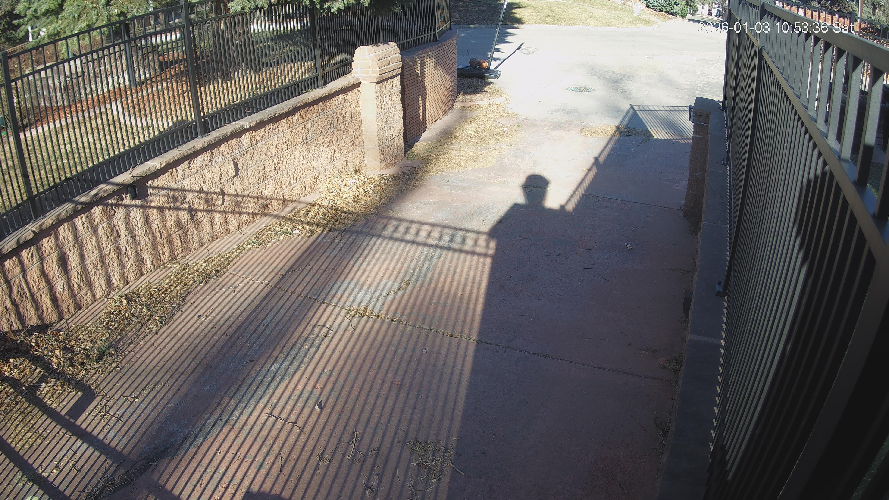

| Property | Value |
|----------|-------|
| **IP Address** | 192.168.20.55 |
| **Model** | IP8M-MT2544E |
| **Priority** | P0 |
| **Detection** | ✅ Enabled |

**Frigate Runtime:** ⚠️ camera_fps=1.0, process_fps=0.6, skipped=0.5 (50%), detection_fps=5.4

#### Encoder Configuration (from Amcrest API)

| Stream | Resolution | FPS | Bitrate | Codec | GOP | Enabled |
|--------|------------|-----|---------|-------|-----|---------|
| Main (Day) | 3840x2160 | 15 | 10240 kbps | H.264 | 15 | ✅ |
| Main (Night) | 3840x2160 | 15 | 10240 kbps | H.264 | 15 | ✅ |
| Sub1 (Day) | 704x480 | 5 | 512 kbps | H.264 | 5 | ✅ |
| Sub1 (Night) | 1280x720 | 5 | 1024 kbps | H.264 | 5 | ✅ |
| Sub2 (Day) | 352x240 | 15 | 0 kbps | H.264 | 30 | ✅ |

**Video Color:** Brightness=50, Contrast=50, Saturation=50, Gamma=50, Hue=50, Style=Standard

**Exposure Settings:** Mode=Auto, WhiteBalance=Auto, DayNight=Auto, Backlight=Off

#### Scene Analysis

**Overview:** driveway_gate" camera effectively monitors the primary vehicle and pedestrian entry point to the property, capturing both the approach and the area immediately inside the gate. The coverage is suitable for security purposes, with minor improvements possible for enhanced detection and nighttime visibility.

**Camera Position:** The camera appears to be mounted on a gate or fence post at approximately head height (5-7 feet above ground).

**Field of View:** Medium to wide angle, covering the entire width of the driveway entrance and a portion of the driveway beyond the gate.

**Priority Detection Zones:** Directly in front of the gate ; The driveway area just outside the gate; **Areas to Mask:**

**Security Assessment:** Good. Recommendations: Install lighting for nighttime coverage if not already present


---

### driveway_suite_door

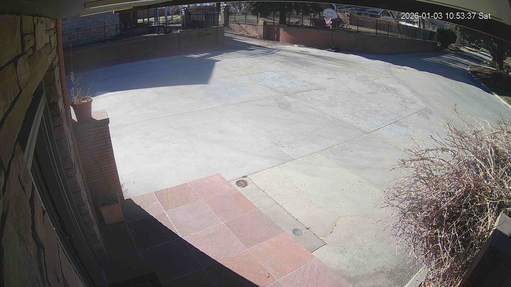

| Property | Value |
|----------|-------|
| **IP Address** | 192.168.20.247 |
| **Model** | IP8M-2496E-V2 |
| **Priority** | P0 |
| **Detection** | ✅ Enabled |

**Frigate Runtime:** ✅ camera_fps=1.1, process_fps=1.1, skipped=0.0 (0%), detection_fps=1.3

#### Encoder Configuration (from Amcrest API)

| Stream | Resolution | FPS | Bitrate | Codec | GOP | Enabled |
|--------|------------|-----|---------|-------|-----|---------|
| Main (Day) | 3840x2160 | 15 | 8192 kbps | H.264 | 15 | ✅ |
| Main (Night) | 3840x2160 | 15 | 8192 kbps | H.264 | 15 | ✅ |
| Sub1 (Day) | 704x480 | 5 | 512 kbps | H.264 | 5 | ✅ |
| Sub1 (Night) | 1280x720 | - | 1024 kbps | H.264 | - | ❌ |
| Sub2 (Day) | 704x480 | - | 1024 kbps | H.264 | - | ❌ |

**Video Color:** Brightness=50, Contrast=50, Saturation=50, Gamma=50, Hue=50, Style=Standard

**Exposure Settings:** Mode=Auto, WhiteBalance=Auto, DayNight=Auto, Backlight=Off

#### Scene Analysis

**Overview:** driveway_suite_door" camera effectively monitors the main driveway, the approach to a suite or side door, and the perimeter wall/gate area. Coverage is broad, with good visibility of potential entry/exit points and activity zones, making it well-suited for detecting both pedestrian and vehicle movement in this area. Minor adjustments could further improve security and reduce false alarms.

**Camera Position:** The camera is mounted on the exterior wall of a building, likely above or adjacent to a doorway (possibly a suite or side entrance).

**Field of View:** Medium to wide angle, capturing a large portion of the driveway and the area leading up to the entry door. **Blind spots:** The left edge is partially obstructed by the building wall.; The top edge is shadowed by an overhang, which may limit upward visibility.

**Priority Detection Zones:** **Areas to Mask:**

**Security Assessment:** Good. Recommendations: Ensure the lighting fixture is functional for effective nighttime monitoring


---

### entryway_front_door


| Property | Value |
|----------|-------|
| **IP Address** | 192.168.20.78 |
| **Model** | IP8M-2496E-V2 |
| **Priority** | P1 |
| **Detection** | ✅ Enabled |

**Frigate Runtime:** ✅ camera_fps=1.0, process_fps=1.1, skipped=0.0 (0%), detection_fps=2.1

#### Encoder Configuration (from Amcrest API)

| Stream | Resolution | FPS | Bitrate | Codec | GOP | Enabled |
|--------|------------|-----|---------|-------|-----|---------|
| Main (Day) | 3840x2160 | 15 | 8192 kbps | H.264 | 15 | ✅ |
| Main (Night) | 3840x2160 | 15 | 8192 kbps | H.264 | 15 | ✅ |
| Sub1 (Day) | 704x480 | 5 | 512 kbps | H.264 | 5 | ✅ |
| Sub1 (Night) | 1280x720 | - | 1024 kbps | H.264 | - | ❌ |
| Sub2 (Day) | 704x480 | - | 1024 kbps | H.264 | - | ❌ |

**Video Color:** Brightness=50, Contrast=50, Saturation=50, Gamma=50, Hue=50, Style=Standard

**Exposure Settings:** Mode=Auto, WhiteBalance=Auto, DayNight=Auto, Backlight=Off

#### Scene Analysis

**Overview:** solid coverage of the front entryway, capturing both the porch and the main approach via the driveway. While it is well-positioned for monitoring visitors and deliveries, there are minor blind spots at the door threshold and to the extreme sides. Lighting is generally sufficient, but the shaded porch may require enhanced night vision or supplemental lighting for optimal security.

**Camera Position:** The camera appears to be mounted under a covered entryway or porch, attached to the wall at a height of approximately 7–9 feet.

**Field of View:** Medium-wide angle. The camera covers the entire entryway, the immediate porch, and a significant portion of the driveway and front approach. **Blind spots:** The area directly under the camera (door threshold) is not fully visible.; The overhang/roof creates a shadow and may obscure vertical visibility.

**Priority Detection Zones:** Porch/entryway; Steps/threshold; Driveway entrance

**Security Assessment:** Good. Recommendations: Ensure the artificial light is functional for nighttime visibility


---

### frontyard_1

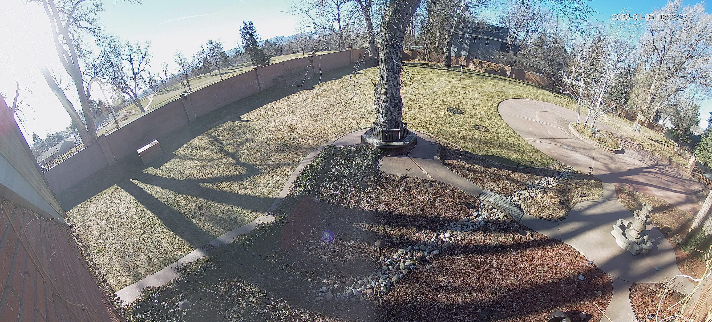

| Property | Value |
|----------|-------|
| **IP Address** | 192.168.20.16 |
| **Model** | IP8M-DLB2998EW-AI |
| **Priority** | P0 |
| **Detection** | ✅ Enabled |

**Frigate Runtime:** ⚠️ camera_fps=1.0, process_fps=0.3, skipped=0.7 (70%), detection_fps=5.4

#### Encoder Configuration (from Amcrest API)

| Stream | Resolution | FPS | Bitrate | Codec | GOP | Enabled |
|--------|------------|-----|---------|-------|-----|---------|
| Main (Day) | 4096x1856 | 15 | 10240 kbps | H.264 | 15 | ✅ |
| Main (Night) | 4096x1856 | 15 | 10240 kbps | H.264 | 15 | ✅ |
| Sub1 (Day) | 640x480 | 5 | 384 kbps | H.264 | 5 | ✅ |
| Sub1 (Night) | 704x480 | 5 | 512 kbps | H.264 | 5 | ✅ |
| Sub2 (Day) | 704x480 | - | 1024 kbps | H.264 | - | ❌ |

**Video Color:** Brightness=50, Contrast=50, Saturation=50, Gamma=50, Hue=50, Style=Standard

**Exposure Settings:** Mode=Auto, WhiteBalance=Auto, DayNight=Auto, Backlight=Off

#### Scene Analysis

**Overview:** comprehensive, wide-angle surveillance of a large, landscaped front yard. It effectively monitors main walkways, the central yard, and the perimeter wall, with minor blind spots near the building and potential glare issues. The setup is well-suited for detecting movement and activity across most of the yard, with recommendations for minor adjustments to maximize security coverage.

**Camera Position:** The camera is mounted high on the corner of a building, likely at the second-story or roofline level.

**Field of View:** Wide-angle coverage; the camera captures almost the entire front yard up to the perimeter wall. **Blind spots:** The far left edge (due to the building wall); Some areas directly beneath the camera may be partially obscured.

**Entry/Exit Points:** Main walkway leading from the lower right ; Gate or opening in the perimeter wall 

**Priority Detection Zones:** Area near the central tree/bench; **Masking Recommendations:**; Far left where sun glare is prominent

**Security Assessment:** Excellent. Recommendations: Adjust or shield the camera to reduce sun glare during certain hours


---

### frontyard_circle_driveway

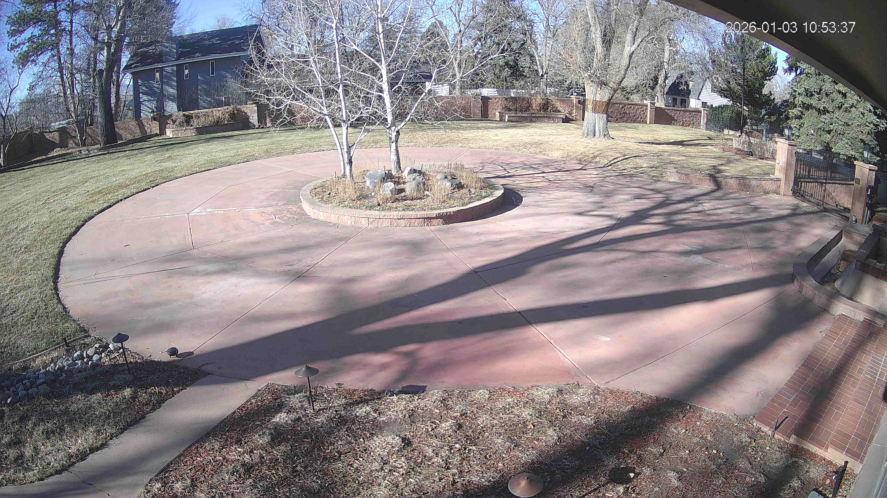

| Property | Value |
|----------|-------|
| **IP Address** | 192.168.20.199 |
| **Model** | IP8M-2496E-V2 |
| **Priority** | P0 |
| **Detection** | ✅ Enabled |

**Frigate Runtime:** ⚠️ camera_fps=1.0, process_fps=0.4, skipped=0.6 (60%), detection_fps=5.3

#### Encoder Configuration (from Amcrest API)

| Stream | Resolution | FPS | Bitrate | Codec | GOP | Enabled |
|--------|------------|-----|---------|-------|-----|---------|
| Main (Day) | 3840x2160 | 15 | 8192 kbps | H.264 | 15 | ✅ |
| Main (Night) | 3840x2160 | 15 | 8192 kbps | H.264 | 15 | ✅ |
| Sub1 (Day) | 704x480 | 5 | 512 kbps | H.264 | 5 | ✅ |
| Sub1 (Night) | 1280x720 | - | 1024 kbps | H.264 | - | ❌ |
| Sub2 (Day) | 704x480 | - | 1024 kbps | H.264 | - | ❌ |

**Video Color:** Brightness=50, Contrast=50, Saturation=50, Gamma=50, Hue=50, Style=Standard

**Exposure Settings:** Mode=Auto, WhiteBalance=Auto, DayNight=Auto, Backlight=Off

#### Scene Analysis

**Overview:** frontyard_circle_driveway" camera is well-positioned to monitor the main vehicle and pedestrian approaches to the property, providing a wide, clear view of the circular driveway, central landscaping, and entry points. Coverage is excellent for both security and visitor monitoring, with only minor peripheral blind spots.

**Camera Position:** The camera is mounted under a structure (possibly the eave of a house or porch roof), as evidenced by the shadowed upper right corner.

**Field of View:** Wide-angle coverage, encompassing the entire circular driveway, central island, and large portions of the front yard. **Blind spots:** The upper right corner is partially obstructed by the building structure.; The far left and right edges may have minor blind spots beyond the frame.

**Priority Detection Zones:** Main gate/vehicle entrance ; Walkway leading to the house ; Steps/porch area 

**Security Assessment:** Excellent. Recommendations: Ensure landscape lights are functional for nighttime visibility


---

### frontyard_circle_driveway_2

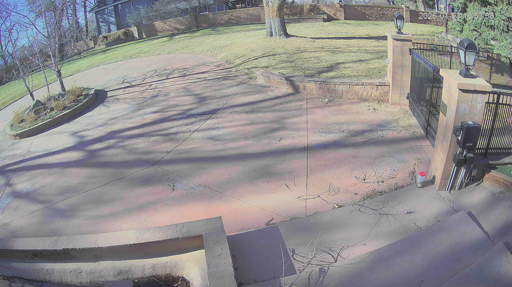

| Property | Value |
|----------|-------|
| **IP Address** | 192.168.20.89 |
| **Model** | IP8M-2496E-V2 |
| **Priority** | P0 |
| **Detection** | ✅ Enabled |

**Frigate Runtime:** ⚠️ camera_fps=1.1, process_fps=0.2, skipped=0.9 (82%), detection_fps=5.3

#### Encoder Configuration (from Amcrest API)

| Stream | Resolution | FPS | Bitrate | Codec | GOP | Enabled |
|--------|------------|-----|---------|-------|-----|---------|
| Main (Day) | 3840x2160 | 15 | 8192 kbps | H.264 | 15 | ✅ |
| Main (Night) | 3840x2160 | 15 | 8192 kbps | H.264 | 15 | ✅ |
| Sub1 (Day) | 704x480 | 5 | 512 kbps | H.264 | 5 | ✅ |
| Sub1 (Night) | 1280x720 | - | 1024 kbps | H.264 | - | ❌ |
| Sub2 (Day) | 704x480 | - | 1024 kbps | H.264 | - | ❌ |

**Video Color:** Brightness=50, Contrast=50, Saturation=50, Gamma=50, Hue=50, Style=Standard

**Exposure Settings:** Mode=Auto, WhiteBalance=Auto, DayNight=Auto, Backlight=Off

#### Scene Analysis

**Overview:** camera is optimally positioned to monitor the main vehicle and pedestrian entry points to the property, including the driveway gate, circular drive, and approach to the residence. The field of view is wide and comprehensive, with only minor blind spots near the edges. Lighting is generally good, but additional coverage or lighting may be needed for complete nighttime security.

**Camera Position:** The camera appears to be mounted at a medium height, likely on a wall or post near the entrance steps, angled slightly downward.

**Field of View:** Wide angle, capturing the entire circular driveway, entry gate, and a significant portion of the front yard.

**Priority Detection Zones:** Gate entrance and immediate driveway area; Steps and walkway leading to the residence; Circular driveway, especially near the planter

**Security Assessment:** Excellent


---

### frontyard_garden

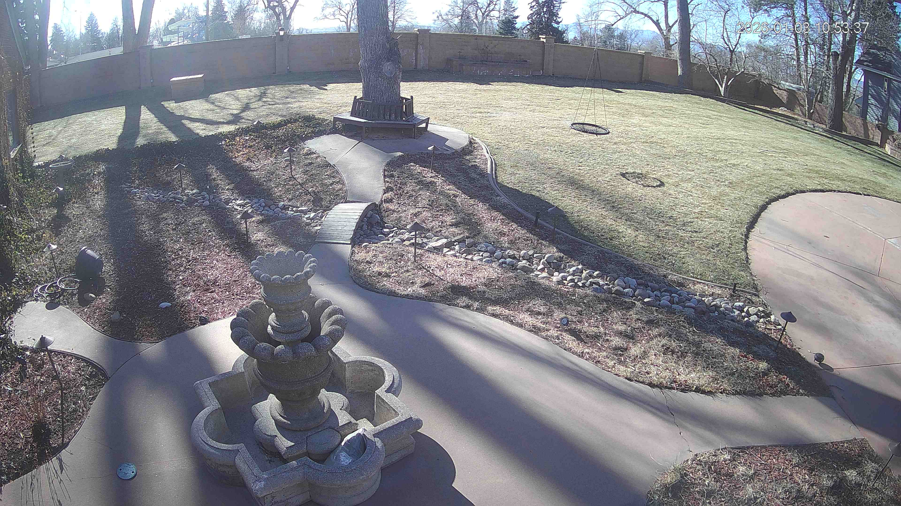

| Property | Value |
|----------|-------|
| **IP Address** | 192.168.20.224 |
| **Model** | IP8M-2496E-V2 |
| **Priority** | P1 |
| **Detection** | ✅ Enabled |

**Frigate Runtime:** ✅ camera_fps=1.1, process_fps=1.1, skipped=0.0 (0%), detection_fps=2.8

#### Encoder Configuration (from Amcrest API)

| Stream | Resolution | FPS | Bitrate | Codec | GOP | Enabled |
|--------|------------|-----|---------|-------|-----|---------|
| Main (Day) | 3840x2160 | 15 | 8192 kbps | H.264 | 15 | ✅ |
| Main (Night) | 3840x2160 | 15 | 8192 kbps | H.264 | 15 | ✅ |
| Sub1 (Day) | 704x480 | 5 | 512 kbps | H.264 | 5 | ✅ |
| Sub1 (Night) | 1280x720 | - | 1024 kbps | H.264 | - | ❌ |
| Sub2 (Day) | 704x480 | - | 1024 kbps | H.264 | - | ❌ |

**Video Color:** Brightness=50, Contrast=50, Saturation=50, Gamma=50, Hue=50, Style=Standard

**Exposure Settings:** Mode=Auto, WhiteBalance=Auto, DayNight=Auto, Backlight=Off

#### Scene Analysis

**Overview:** frontyard_garden" camera provides a wide, clear view of a landscaped front yard with walkways, a central fountain, and a large tree. It is well-positioned for general surveillance, with minor blind spots that could be addressed with supplementary cameras. The area is well-lit during the day, with pathway lights for nighttime. Detection zones should focus on walkways and entry paths, while masking should be considered for moving foliage. Overall, the camera offers strong coverage for the front garden area.

**Camera Position:** The camera appears to be mounted on the exterior of a building, likely at a height of 8–12 feet, possibly under an eave or on a wall.

**Field of View:** Wide-angle coverage, capturing the majority of the front yard and garden area. **Blind spots:** The large tree and its bench could obscure activity directly behind them.

**Entry/Exit Points:** Walkways leading from the house/building into the yard; The perimeter wall may have gates not visible in this view

**Priority Detection Zones:** Area around the central tree and bench; Near the fountain ; **Areas to Mask:**

**Security Assessment:** Excellent. Recommendations: Ensure pathway lights are functional for nighttime visibility


---

### garage_1

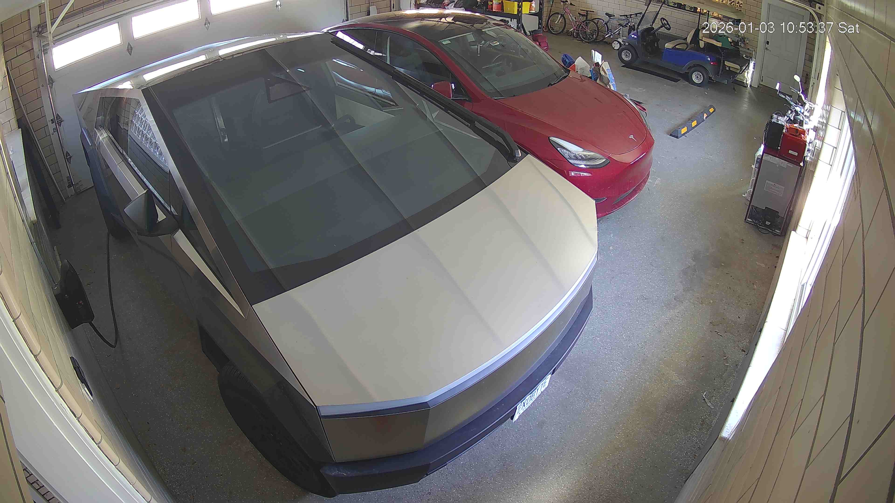

| Property | Value |
|----------|-------|
| **IP Address** | 192.168.20.9 |
| **Model** | IP8M-2496E-V2 |
| **Priority** | P1 |
| **Detection** | ✅ Enabled |

**Frigate Runtime:** ✅ camera_fps=1.0, process_fps=1.0, skipped=0.0 (0%), detection_fps=0.0

#### Encoder Configuration (from Amcrest API)

| Stream | Resolution | FPS | Bitrate | Codec | GOP | Enabled |
|--------|------------|-----|---------|-------|-----|---------|
| Main (Day) | 3840x2160 | 15 | 8192 kbps | H.264 | 15 | ✅ |
| Main (Night) | 3840x2160 | 15 | 8192 kbps | H.264 | 15 | ✅ |
| Sub1 (Day) | 704x480 | 5 | 512 kbps | H.264 | 5 | ✅ |
| Sub1 (Night) | 1280x720 | - | 1024 kbps | H.264 | - | ❌ |
| Sub2 (Day) | 704x480 | - | 1024 kbps | H.264 | - | ❌ |

**Video Color:** Brightness=50, Contrast=50, Saturation=50, Gamma=50, Hue=50, Style=Standard

**Exposure Settings:** Mode=Auto, WhiteBalance=Auto, DayNight=Auto, Backlight=Off

#### Scene Analysis

**Overview:** comprehensive coverage of a residential garage, monitoring parked vehicles, entry points, and storage areas. The camera is well-positioned for general security but could be supplemented for full coverage and improved identification at entry points.

**Camera Position:** The camera is mounted high on the left wall, near the ceiling, close to the garage door.

**Field of View:** Wide-angle coverage, capturing nearly the entire garage width and depth.

**Priority Detection Zones:** Garage door area ; Side door ; Pathways between vehicles and to storage areas

**Security Assessment:** Good


---

### garage_breezeway

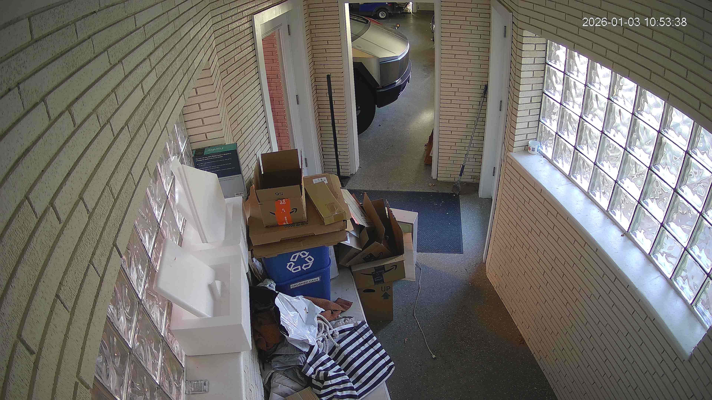

| Property | Value |
|----------|-------|
| **IP Address** | 192.168.20.133 |
| **Model** | IP8M-2496E-V2 |
| **Priority** | P1 |
| **Detection** | ✅ Enabled |

**Frigate Runtime:** ✅ camera_fps=1.1, process_fps=1.1, skipped=0.0 (0%), detection_fps=1.1

#### Encoder Configuration (from Amcrest API)

| Stream | Resolution | FPS | Bitrate | Codec | GOP | Enabled |
|--------|------------|-----|---------|-------|-----|---------|
| Main (Day) | 3840x2160 | 15 | 8192 kbps | H.264 | 15 | ✅ |
| Main (Night) | 3840x2160 | 15 | 8192 kbps | H.264 | 15 | ✅ |
| Sub1 (Day) | 704x480 | 5 | 512 kbps | H.264 | 5 | ✅ |
| Sub1 (Night) | 1280x720 | - | 1024 kbps | H.264 | - | ❌ |
| Sub2 (Day) | 704x480 | - | 1024 kbps | H.264 | - | ❌ |

**Video Color:** Brightness=50, Contrast=50, Saturation=50, Gamma=50, Hue=50, Style=Standard

**Exposure Settings:** Mode=Auto, WhiteBalance=Auto, DayNight=Auto, Backlight=Off

#### Scene Analysis

**Overview:** garage_breezeway" camera effectively monitors the transitional space between the garage and the house, capturing key entry/exit points. The field of view is well-suited for detecting movement through the breezeway, but clutter and limited side coverage could be improved for optimal security.

**Camera Position:** The camera is mounted high on the wall, angled downward, likely near the ceiling in a corner.

**Field of View:** Medium angle—covers the breezeway corridor and the immediate garage entry. **Blind spots:** The left and right edges near the camera are not visible.; The pile of boxes and items partially obstructs the lower left area.

**Priority Detection Zones:** Garage entry/exit ; Side door ; Breezeway walkway 

**Security Assessment:** Good. Recommendations: Ensure artificial lighting is adequate for nighttime coverage


---

### greenhouse_1

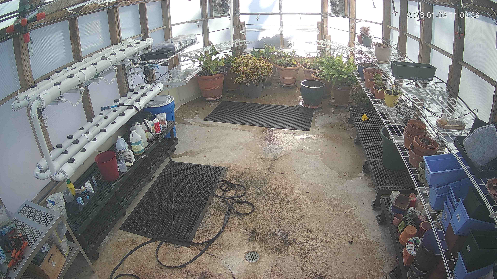

| Property | Value |
|----------|-------|
| **IP Address** | 192.168.20.146 |
| **Model** | IP8M-2496E-V2 |
| **Priority** | P2 |
| **Detection** | ❌ Disabled |

**Frigate Runtime:** ✅ camera_fps=1.1, process_fps=1.1, skipped=0.0 (0%), detection_fps=0.0

#### Encoder Configuration (from Amcrest API)

| Stream | Resolution | FPS | Bitrate | Codec | GOP | Enabled |
|--------|------------|-----|---------|-------|-----|---------|
| Main (Day) | 3840x2160 | 15 | 6144 kbps | H.264 | 15 | ✅ |
| Main (Night) | 3840x2160 | 15 | 6144 kbps | H.264 | 15 | ✅ |
| Sub1 (Day) | 704x480 | 5 | 512 kbps | H.264 | 5 | ✅ |
| Sub1 (Night) | 1280x720 | - | 1024 kbps | H.264 | - | ❌ |
| Sub2 (Day) | 704x480 | - | 1024 kbps | H.264 | - | ❌ |

**Video Color:** Brightness=50, Contrast=50, Saturation=50, Gamma=50, Hue=50, Style=Standard

**Exposure Settings:** Mode=Auto, WhiteBalance=Auto, DayNight=Auto, Backlight=Off

#### Scene Analysis

**Overview:** monitors the main interior of a greenhouse, capturing workspaces, plant storage, and equipment. The coverage is wide and functional for general activity monitoring, but could benefit from additional cameras for entry/exit coverage and improved low-light performance.

**Camera Position:** The camera appears to be mounted high in a corner, likely near the ceiling, facing downward at a diagonal angle towards the center of the greenhouse.

**Field of View:** Wide angle, covering nearly the entire width and depth of the greenhouse from this vantage point.

**Priority Detection Zones:** Central aisle and work area ; Near shelving units ; **Areas to Mask:**

**Security Assessment:** Good. Recommendations: Ensure shelving does not block critical sightlines


---

### greenhouse_2

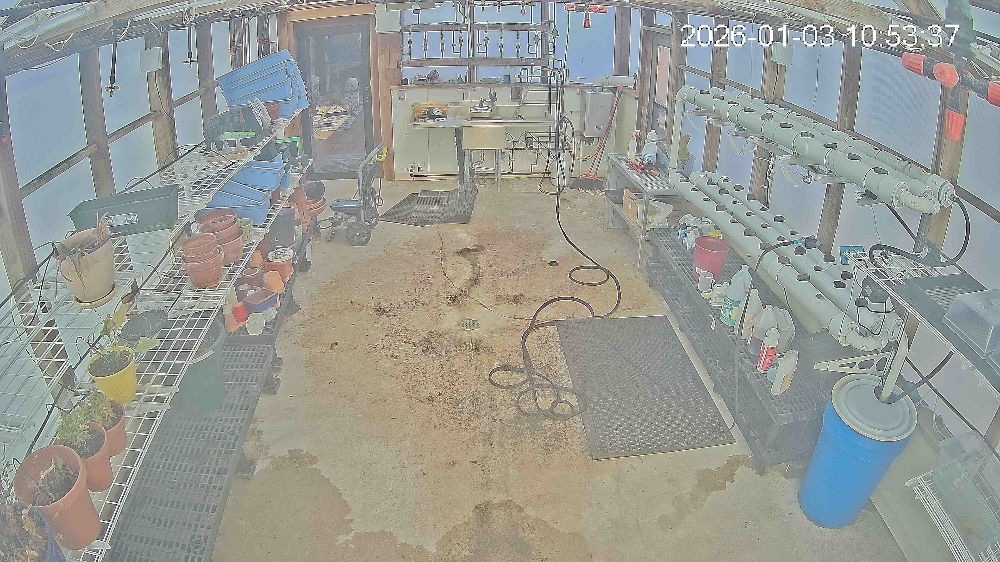

| Property | Value |
|----------|-------|
| **IP Address** | 192.168.20.118 |
| **Model** | IP8M-T2599EW-AI-V3 |
| **Priority** | P2 |
| **Detection** | ❌ Disabled |

**Frigate Runtime:** ✅ camera_fps=0.0, process_fps=0.0, skipped=0.0 (0%), detection_fps=0.0

#### Encoder Configuration (from Amcrest API)

| Stream | Resolution | FPS | Bitrate | Codec | GOP | Enabled |
|--------|------------|-----|---------|-------|-----|---------|
| Main (Day) | 3840x2160 | 15 | 6144 kbps | H.264 | 15 | ✅ |
| Main (Night) | 3840x2160 | 15 | 6144 kbps | H.264 | 15 | ✅ |
| Sub1 (Day) | 704x480 | 5 | 512 kbps | H.264 | 5 | ✅ |
| Sub1 (Night) | 1280x720 | - | 1024 kbps | H.264 | - | ✅ |
| Sub2 (Day) | 704x480 | - | 1024 kbps | H.264 | - | ❌ |

**Video Color:** Brightness=50, Contrast=50, Saturation=50, Gamma=50, Hue=50, Style=Standard

**Exposure Settings:** Mode=Auto, WhiteBalance=Auto, DayNight=Auto, Backlight=Off

#### Scene Analysis

**Overview:** greenhouse_2" camera is well-positioned to monitor the main operational and access areas of a greenhouse. It captures workbenches, hydroponic systems, storage, and the primary entry/exit point, making it effective for both security and operational oversight. Minor blind spots exist beneath benches and directly below the camera, but overall coverage is robust.


---

### panorama_cir_gate

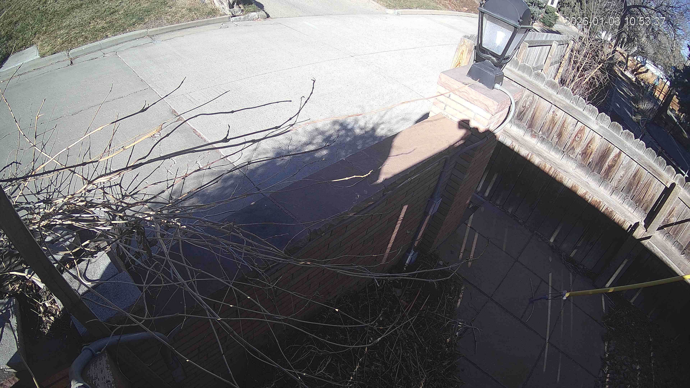

| Property | Value |
|----------|-------|
| **IP Address** | 192.168.20.7 |
| **Model** | IP8M-2496E-V2 |
| **Priority** | P0 |
| **Detection** | ✅ Enabled |

**Frigate Runtime:** ⚠️ camera_fps=1.0, process_fps=0.9, skipped=0.2 (20%), detection_fps=5.3

#### Encoder Configuration (from Amcrest API)

| Stream | Resolution | FPS | Bitrate | Codec | GOP | Enabled |
|--------|------------|-----|---------|-------|-----|---------|
| Main (Day) | 3840x2160 | 15 | 6144 kbps | H.264 | 15 | ✅ |
| Main (Night) | 3840x2160 | 15 | 6144 kbps | H.264 | 15 | ✅ |
| Sub1 (Day) | 704x480 | 5 | 512 kbps | H.264 | 5 | ✅ |
| Sub1 (Night) | 1280x720 | - | 1024 kbps | H.264 | - | ❌ |
| Sub2 (Day) | 704x480 | - | 1024 kbps | H.264 | - | ❌ |

**Video Color:** Brightness=50, Contrast=50, Saturation=50, Gamma=50, Hue=50, Style=Standard

**Exposure Settings:** Mode=Auto, WhiteBalance=Auto, DayNight=Auto, Backlight=Off

#### Scene Analysis

**Overview:** panorama_cir_gate" camera is well-positioned to monitor a key entry point (gate) and the adjacent street. It covers both public and private areas, making it effective for detecting visitors or potential intruders. Minor adjustments to vegetation and detection zones would further enhance security coverage.

**Camera Position:** The camera is mounted high, likely atop a brick pillar or wall at the entrance to a property.

**Field of View:** Medium to wide angle, capturing both the secure side of the gate and the public street. **Blind spots:** Some branches partially obscure the lower left portion.; The far left and right edges may miss activity close to the fence line.

**Entry/Exit Points:** Street access beyond the gate; Walkway leading from the gate into the property

**Priority Detection Zones:** Gate and immediate entryway ; Walkway leading from the gate; Street-side approach to the gate

**Security Assessment:** Good. Recommendations: Ensure the lamp post is functional for nighttime coverage


---

### panorama_cir_north

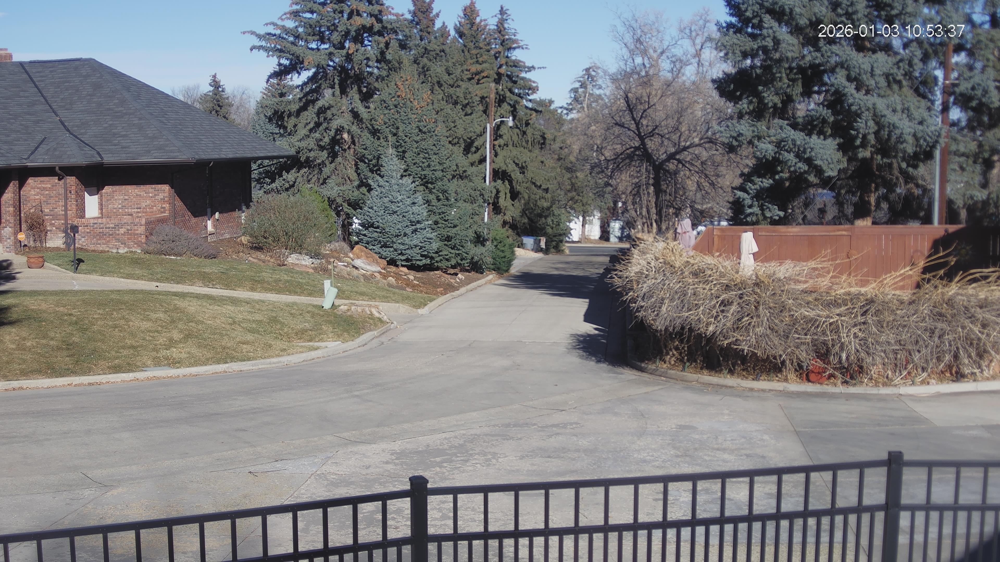

| Property | Value |
|----------|-------|
| **IP Address** | 192.168.20.127 |
| **Model** | IP8M-MB2546E |
| **Priority** | P0 |
| **Detection** | ✅ Enabled |

**Frigate Runtime:** ✅ camera_fps=1.1, process_fps=1.1, skipped=0.0 (0%), detection_fps=2.2

#### Encoder Configuration (from Amcrest API)

| Stream | Resolution | FPS | Bitrate | Codec | GOP | Enabled |
|--------|------------|-----|---------|-------|-----|---------|
| Main (Day) | 3840x2160 | 12 | 6144 kbps | H.264 | 12 | ✅ |
| Main (Night) | 3840x2160 | 12 | 6144 kbps | H.264 | 12 | ✅ |
| Sub1 (Day) | 704x480 | 5 | 512 kbps | H.264 | 5 | ✅ |
| Sub1 (Night) | 1280x720 | 5 | 1024 kbps | H.264 | 5 | ✅ |
| Sub2 (Day) | 352x240 | 15 | 0 kbps | H.264 | 30 | ✅ |

**Video Color:** Brightness=50, Contrast=50, Saturation=50, Gamma=50, Hue=50, Style=Standard

**Exposure Settings:** Mode=Auto, WhiteBalance=Auto, DayNight=Auto, Backlight=Off

#### Scene Analysis

**Overview:** panorama_cir_north" camera effectively monitors a residential intersection, driveway, and property entrance with a wide field of view. It is well-positioned for general surveillance but may benefit from supplementary coverage in areas obscured by landscaping.

**Camera Position:** The camera appears to be mounted at a moderate height, likely on a fence post or gate pillar, just above head level (approx. 6-8 feet).

**Field of View:** Wide-angle coverage, encompassing both sides of the street and a significant portion of the intersection. **Blind spots:** The black metal fence at the bottom may obscure the very closest ground area.

**Entry/Exit Points:** Main street/intersection ; Driveway entrance ; Sidewalk/path to the house ; Potential gate or access point at the fence 

**Priority Detection Zones:** Street intersection and driveway entrance ; Sidewalk/path to the house ; Area near the gate/fence 

**Security Assessment:** Excellent. Recommendations: Adjust detection zones to minimize false positives from moving vegetation; Ensure nighttime illumination, as tree cover may create dark spots after sunset


---

### panorama_cir_west

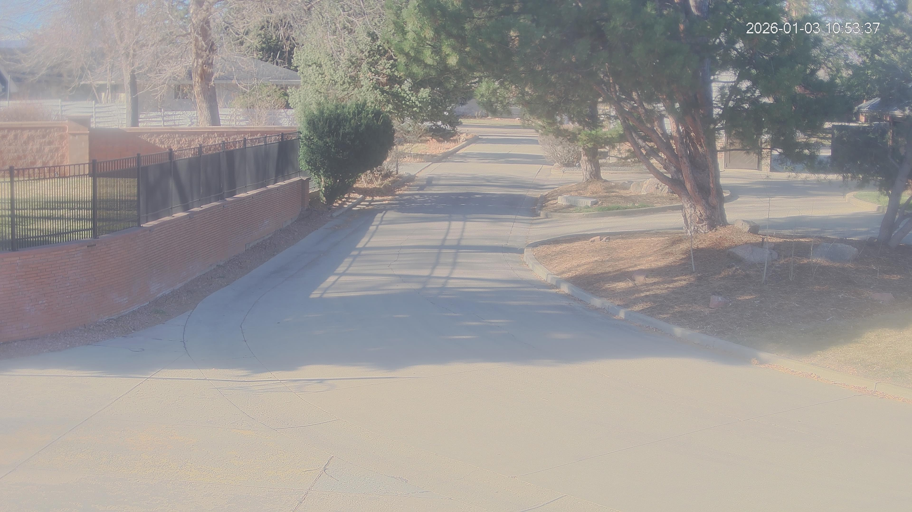

| Property | Value |
|----------|-------|
| **IP Address** | 192.168.20.234 |
| **Model** | IP8M-MB2546E |
| **Priority** | P0 |
| **Detection** | ✅ Enabled |

**Frigate Runtime:** ✅ camera_fps=1.1, process_fps=1.0, skipped=0.0 (0%), detection_fps=3.2

#### Encoder Configuration (from Amcrest API)

| Stream | Resolution | FPS | Bitrate | Codec | GOP | Enabled |
|--------|------------|-----|---------|-------|-----|---------|
| Main (Day) | 3840x2160 | 12 | 6144 kbps | H.264 | 12 | ✅ |
| Main (Night) | 3840x2160 | 5 | 6144 kbps | H.264 | 20 | ✅ |
| Sub1 (Day) | 704x480 | 5 | 512 kbps | H.264 | 5 | ✅ |
| Sub1 (Night) | 1280x720 | 5 | 1024 kbps | H.264 | 5 | ✅ |
| Sub2 (Day) | 352x240 | 15 | 0 kbps | H.264 | 30 | ✅ |

**Video Color:** Brightness=50, Contrast=50, Saturation=50, Gamma=50, Hue=50, Style=Standard

**Exposure Settings:** Mode=Auto, WhiteBalance=Auto, DayNight=Auto, Backlight=Off

#### Scene Analysis

**Overview:** panorama_cir_west" camera effectively monitors a curved roadway and its immediate surroundings, providing good coverage of vehicular and pedestrian movement along this access route. Some areas of reduced visibility exist due to landscaping, and lighting enhancements are recommended for improved nighttime security.

**Camera Position:** The camera appears to be mounted at a moderate height, likely on a pole or building corner, angled slightly downward.

**Field of View:** Wide angle—captures a broad section of the roadway, adjacent landscaping, and portions of property boundaries. **Blind spots:** Large trees on the right create some shadowed and partially obstructed areas.; Shrubs and a wall on the left may obscure activity close to the fence line.

**Priority Detection Zones:** **Areas to Mask:**

**Security Assessment:** Good


---

### patio_1

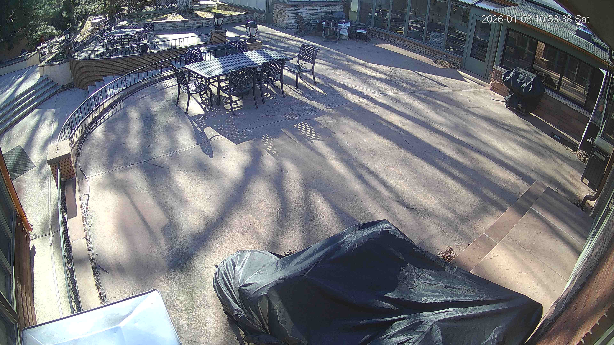

| Property | Value |
|----------|-------|
| **IP Address** | 192.168.20.59 |
| **Model** | IP8M-2496E-V2 |
| **Priority** | P1 |
| **Detection** | ✅ Enabled |

**Frigate Runtime:** ⚠️ camera_fps=1.1, process_fps=0.8, skipped=0.3 (27%), detection_fps=5.4

#### Encoder Configuration (from Amcrest API)

| Stream | Resolution | FPS | Bitrate | Codec | GOP | Enabled |
|--------|------------|-----|---------|-------|-----|---------|
| Main (Day) | 3840x2160 | 15 | 8192 kbps | H.264 | 15 | ✅ |
| Main (Night) | 3840x2160 | 15 | 8192 kbps | H.264 | 15 | ✅ |
| Sub1 (Day) | 704x480 | 5 | 512 kbps | H.264 | 5 | ✅ |
| Sub1 (Night) | 1280x720 | - | 1024 kbps | H.264 | - | ❌ |
| Sub2 (Day) | 704x480 | - | 1024 kbps | H.264 | - | ❌ |

**Video Color:** Brightness=50, Contrast=50, Saturation=50, Gamma=50, Hue=50, Style=Standard

**Exposure Settings:** Mode=Auto, WhiteBalance=Auto, DayNight=Auto, Backlight=Off

#### Scene Analysis

**Overview:** patio_1" camera effectively monitors a large patio area, including furniture, access steps, and building entry points. Coverage is broad, but there are minor blind spots near the camera mount and under large objects. Security could be enhanced with additional cameras and optimized lighting for nighttime monitoring.

**Camera Position:** The camera is mounted at a high position, likely under the eaves or on the wall of the building, angled downward.

**Field of View:** Medium to wide angle; the camera covers the majority of the patio and some adjacent walkways and steps. **Blind spots:** The area immediately beneath the camera (bottom left) is not visible.

**Entry/Exit Points:** Steps  leading up to the patio from a lower level; Glass doors/windows  providing access to/from the building; Walkways at the upper level  leading further into the yard

**Priority Detection Zones:** Patio doors/windows  – access to the building; Central patio area; **Areas to Mask:**

**Security Assessment:** Good


---

### patio_2

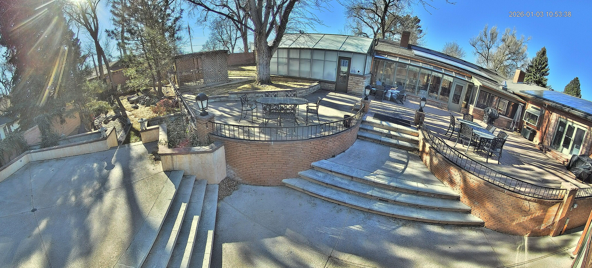

| Property | Value |
|----------|-------|
| **IP Address** | 192.168.20.83 |
| **Model** | IP8M-DLB2998EW-AI |
| **Priority** | P0 |
| **Detection** | ✅ Enabled |

**Frigate Runtime:** ⚠️ camera_fps=1.1, process_fps=0.3, skipped=0.8 (73%), detection_fps=5.4

#### Encoder Configuration (from Amcrest API)

| Stream | Resolution | FPS | Bitrate | Codec | GOP | Enabled |
|--------|------------|-----|---------|-------|-----|---------|
| Main (Day) | 4096x1856 | 15 | 10240 kbps | H.264 | 15 | ✅ |
| Main (Night) | 4096x1856 | 15 | 10240 kbps | H.264 | 15 | ✅ |
| Sub1 (Day) | 640x480 | 5 | 384 kbps | H.264 | 5 | ✅ |
| Sub1 (Night) | 704x480 | 5 | 512 kbps | H.264 | 5 | ✅ |
| Sub2 (Day) | 704x480 | - | 1024 kbps | H.264 | - | ❌ |

**Video Color:** Brightness=50, Contrast=50, Saturation=50, Gamma=50, Hue=50, Style=Standard

**Exposure Settings:** Mode=Auto, WhiteBalance=Auto, DayNight=Auto, Backlight=Off

#### Scene Analysis

**Overview:** a wide, elevated view of a multi-level patio and adjacent yard, monitoring key access points and outdoor activity areas. Coverage is robust, with only minor blind spots and some potential for false alarms from landscaping. Overall, this camera is well-positioned for security and activity monitoring in the patio area.

**Camera Position:** The camera is mounted at an elevated position, likely on a building wall or under an eave, looking downward at a wide angle.

**Field of View:** Wide-angle coverage, capturing multiple levels of the patio, steps, and a large section of the backyard and house. **Blind spots:** Some minor blind spots may exist directly below the camera (base of the steps).; Tall trees and structures on the left edge may obscure parts of the yard.

**Entry/Exit Points:** Main glass door leading into the house ; Additional doors/windows along the house facade; Potential gate or opening near the gazebo/trellis structure

**Priority Detection Zones:** Main patio and steps ; Pathways leading to/from the house and gazebo; Entry points at doors and gates

**Security Assessment:** Excellent. Recommendations: Ensure nighttime lighting is sufficient for all detection zones


---

### patio_japanese_garden

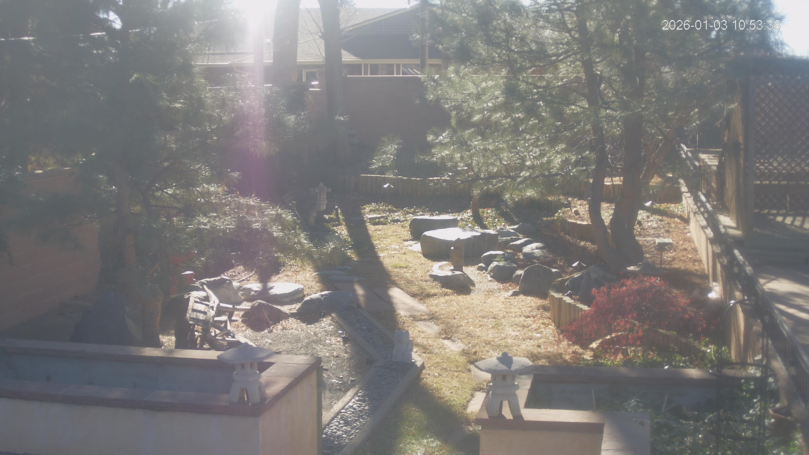

| Property | Value |
|----------|-------|
| **IP Address** | 192.168.20.98 |
| **Model** | IP8M-MB2546E |
| **Priority** | P1 |
| **Detection** | ✅ Enabled |

**Frigate Runtime:** ✅ camera_fps=1.1, process_fps=1.1, skipped=0.0 (0%), detection_fps=5.5

#### Encoder Configuration (from Amcrest API)

| Stream | Resolution | FPS | Bitrate | Codec | GOP | Enabled |
|--------|------------|-----|---------|-------|-----|---------|
| Main (Day) | 3840x2160 | 12 | 6144 kbps | H.264 | 12 | ✅ |
| Main (Night) | 3840x2160 | 12 | 6144 kbps | H.264 | 12 | ✅ |
| Sub1 (Day) | 704x480 | 5 | 512 kbps | H.264 | 5 | ✅ |
| Sub1 (Night) | 1280x720 | 5 | 1024 kbps | H.264 | 5 | ✅ |
| Sub2 (Day) | 352x240 | 15 | 0 kbps | H.264 | 30 | ✅ |

**Video Color:** Brightness=50, Contrast=50, Saturation=50, Gamma=50, Hue=50, Style=Standard

**Exposure Settings:** Mode=Auto, WhiteBalance=Auto, DayNight=Auto, Backlight=Off

#### Scene Analysis

**Overview:** monitors a landscaped Japanese-style garden and patio area, capturing key access points and decorative elements. While coverage is generally good, minor blind spots exist at the extreme edges, and sun glare may impact image quality at certain times of day. Additional cameras or lighting may further enhance security and coverage.

**Camera Position:** The camera appears to be mounted at a medium height, likely on the exterior wall of a building or patio structure, facing outward into the garden.

**Field of View:** The camera has a medium to wide-angle coverage, encompassing the entire width of the garden and most of its depth. **Blind spots:** Some tree branches and foliage partially obscure the left and right edges.

**Priority Detection Zones:** Pathway from the patio into the main garden ; Area near the lattice structure and steps ; Fence line at the back 

**Security Assessment:** Good. Recommendations: Adjust camera angle to reduce sun glare during peak daylight hours


---

### pool_1

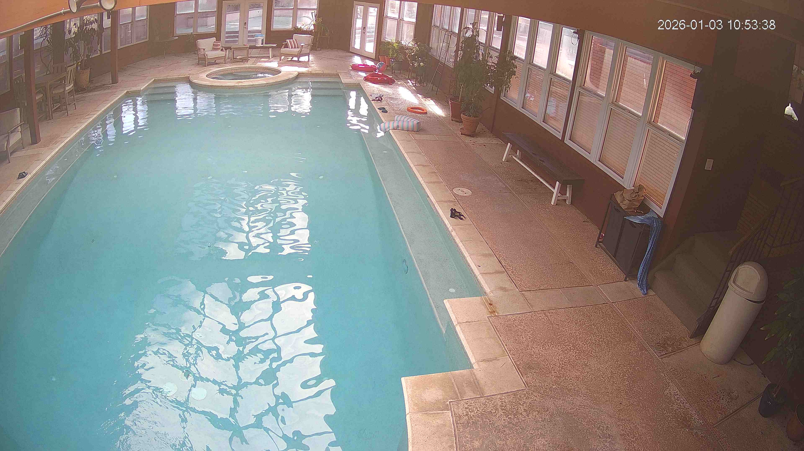

| Property | Value |
|----------|-------|
| **IP Address** | 192.168.20.126 |
| **Model** | IP8M-2496E-V2 |
| **Priority** | P1 |
| **Detection** | ✅ Enabled |

**Frigate Runtime:** ✅ camera_fps=1.0, process_fps=1.1, skipped=0.0 (0%), detection_fps=1.7

#### Encoder Configuration (from Amcrest API)

| Stream | Resolution | FPS | Bitrate | Codec | GOP | Enabled |
|--------|------------|-----|---------|-------|-----|---------|
| Main (Day) | 3840x2160 | 15 | 8192 kbps | H.264 | 15 | ✅ |
| Main (Night) | 3840x2160 | 15 | 8192 kbps | H.264 | 15 | ✅ |
| Sub1 (Day) | 704x480 | 5 | 512 kbps | H.264 | 5 | ✅ |
| Sub1 (Night) | 1280x720 | - | 1024 kbps | H.264 | - | ❌ |
| Sub2 (Day) | 704x480 | - | 1024 kbps | H.264 | - | ❌ |

**Video Color:** Brightness=50, Contrast=50, Saturation=50, Gamma=50, Hue=50, Style=Standard

**Exposure Settings:** Mode=Auto, WhiteBalance=Auto, DayNight=Auto, Backlight=Off

#### Scene Analysis

**Overview:** pool_1" camera provides wide, high-angle coverage of an indoor pool, hot tub, and surrounding deck, with good visibility of entry/exit points and most activity zones. Minor blind spots exist near the camera and behind large objects, but overall coverage is strong for safety and security monitoring.

**Camera Position:** The camera appears to be mounted high on a wall or ceiling, likely in a corner of the indoor pool area.

**Field of View:** Wide-angle coverage, capturing nearly the entire pool, adjacent hot tub, and most of the surrounding deck.

**Entry/Exit Points:** A door or stairway at the bottom right ; Possible exterior door or access point at the far end ; Pathways along the pool deck for movement

**Priority Detection Zones:** Pool perimeter ; Entry/exit points ; Hot tub area

**Security Assessment:** Excellent. Recommendations: Ensure nighttime lighting is sufficient for clear footage after dark


---

### pool_2

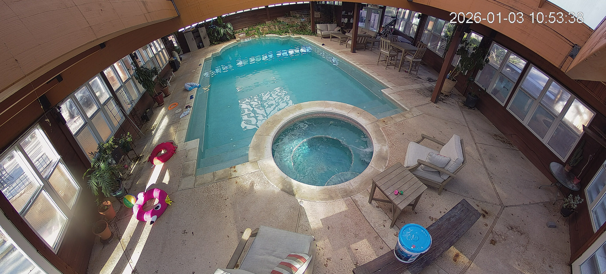

| Property | Value |
|----------|-------|
| **IP Address** | 192.168.20.84 |
| **Model** | IP8M-DLB2998EW-AI |
| **Priority** | P0 |
| **Detection** | ✅ Enabled |

**Frigate Runtime:** ⚠️ camera_fps=1.0, process_fps=0.3, skipped=0.7 (70%), detection_fps=5.3

#### Encoder Configuration (from Amcrest API)

| Stream | Resolution | FPS | Bitrate | Codec | GOP | Enabled |
|--------|------------|-----|---------|-------|-----|---------|
| Main (Day) | 4096x1856 | 15 | 10240 kbps | H.264 | 15 | ✅ |
| Main (Night) | 4096x1856 | 15 | 10240 kbps | H.264 | 15 | ✅ |
| Sub1 (Day) | 640x480 | 5 | 384 kbps | H.264 | 5 | ✅ |
| Sub1 (Night) | 704x480 | 5 | 512 kbps | H.264 | 5 | ✅ |
| Sub2 (Day) | 704x480 | - | 1024 kbps | H.264 | - | ❌ |

**Video Color:** Brightness=50, Contrast=50, Saturation=50, Gamma=50, Hue=50, Style=Standard

**Exposure Settings:** Mode=Auto, WhiteBalance=Auto, DayNight=Auto, Backlight=Off

#### Scene Analysis

**Overview:** pool_2" is optimally positioned to monitor the entire indoor pool area, including the hot tub, deck, and main entry point. It provides excellent coverage for both safety and security, with only minor blind spots in the extreme corners and under furniture. Regular maintenance and strategic motion detection settings will maximize its effectiveness.

**Camera Position:** The camera is ceiling-mounted at a high vantage point, likely near a corner of the enclosed pool area.

**Field of View:** Wide-angle coverage; nearly the entire pool, hot tub, and surrounding deck are visible. **Blind spots:** Some areas under tables or behind large plants may be partially obscured.

**Entry/Exit Points:** A door at the far end of the pool area ; Possible secondary access via windows ; Walkways around the pool for movement within the enclosure

**Priority Detection Zones:** Door at the far end ; Pool and hot tub area ; Walkways adjacent to the pool

**Security Assessment:** Excellent. Recommendations: Ensure adequate artificial lighting for nighttime monitoring


---

### skycam_east

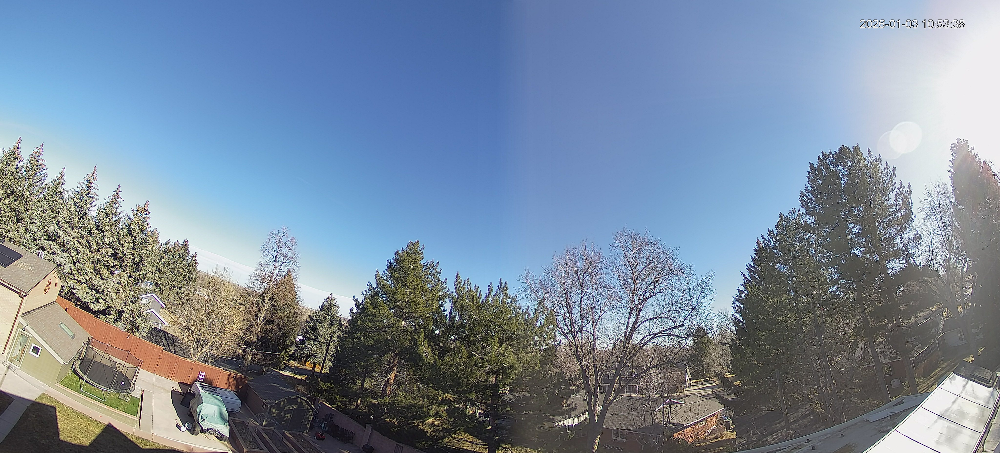

| Property | Value |
|----------|-------|
| **IP Address** | 192.168.20.35 |
| **Model** | IP8M-DLB2998EW-AI |
| **Priority** | P2 |
| **Detection** | ❌ Disabled |

**Frigate Runtime:** ✅ camera_fps=1.1, process_fps=1.1, skipped=0.0 (0%), detection_fps=0.0

#### Encoder Configuration (from Amcrest API)

| Stream | Resolution | FPS | Bitrate | Codec | GOP | Enabled |
|--------|------------|-----|---------|-------|-----|---------|
| Main (Day) | 4096x1856 | 15 | 10240 kbps | H.264 | 15 | ✅ |
| Main (Night) | 4096x1856 | 15 | 10240 kbps | H.264 | 15 | ✅ |
| Sub1 (Day) | 640x480 | 5 | 384 kbps | H.264 | 5 | ✅ |
| Sub1 (Night) | 704x480 | 5 | 512 kbps | H.264 | 5 | ✅ |
| Sub2 (Day) | 704x480 | - | 1024 kbps | H.264 | - | ❌ |

**Video Color:** Brightness=50, Contrast=50, Saturation=50, Gamma=50, Hue=50, Style=Standard

**Exposure Settings:** Mode=Auto, WhiteBalance=Auto, DayNight=Auto, Backlight=Off

#### Scene Analysis

**Overview:** a comprehensive, wide-angle overview of the eastern portion of the property and neighboring lots, ideal for monitoring large-scale activity and environmental conditions. For detailed security, supplement with lower, more focused cameras at entry points and high-traffic areas.

**Camera Position:** The camera appears to be mounted high, likely on the roof or upper story of a building, given the steep downward angle and the wide, elevated perspective.

**Field of View:** Wide-angle coverage; the camera captures a large swath of property and adjacent lots, including a significant portion of the sky. **Blind spots:** Some areas directly beneath the camera and under tree canopies are not visible.; Large trees partially obscure the view of certain ground-level areas.

**Entry/Exit Points:** Backyard gate 

**Priority Detection Zones:** Backyard gate and fence line ; Walkways and patio area; Areas near the trampoline and covered items 

**Security Assessment:** Good. Recommendations: Install motion-activated lighting for improved night coverage; Adjust detection zones to minimize false alarms from tree movement


---

### skycam_west

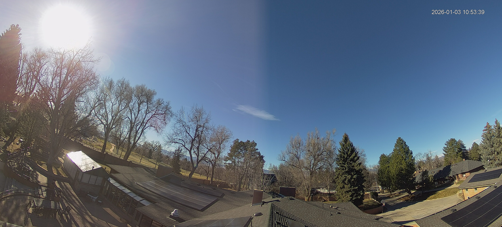

| Property | Value |
|----------|-------|
| **IP Address** | 192.168.20.85 |
| **Model** | IP8M-DLB2998EW-AI |
| **Priority** | P2 |
| **Detection** | ❌ Disabled |

**Frigate Runtime:** ✅ camera_fps=1.1, process_fps=1.1, skipped=0.0 (0%), detection_fps=0.0

#### Encoder Configuration (from Amcrest API)

| Stream | Resolution | FPS | Bitrate | Codec | GOP | Enabled |
|--------|------------|-----|---------|-------|-----|---------|
| Main (Day) | 4096x1856 | 15 | 10240 kbps | H.264 | 15 | ✅ |
| Main (Night) | 4096x1856 | 15 | 10240 kbps | H.264 | 15 | ✅ |
| Sub1 (Day) | 640x480 | 5 | 384 kbps | H.264 | 5 | ✅ |
| Sub1 (Night) | 704x480 | 5 | 512 kbps | H.264 | 5 | ✅ |
| Sub2 (Day) | 704x480 | - | 1024 kbps | H.264 | - | ❌ |

**Video Color:** Brightness=50, Contrast=50, Saturation=50, Gamma=50, Hue=50, Style=Standard

**Exposure Settings:** Mode=Auto, WhiteBalance=Auto, DayNight=Auto, Backlight=Off

#### Scene Analysis

**Overview:** a wide, elevated view of the property’s western side, including rooftops, patio, driveways, and landscaped grounds. While coverage is generally strong, sun glare and tree cover create some blind spots. Supplementary cameras and lighting would enhance overall security and detail capture.

**Camera Position:** The camera appears to be mounted at a high elevation, likely on the roof or upper story of a building.

**Field of View:** Wide-angle, capturing a large expanse of both the property and surrounding landscape. **Blind spots:** The left edge is heavily backlit by the sun, causing glare and loss of detail.

**Entry/Exit Points:** Driveway entrance; Pathways leading from the patio and through the grounds; Possible gates or fence lines at the property boundary

**Priority Detection Zones:** Driveway and entry road; Patio area and walkways; Perimeter fence/gate area

**Security Assessment:** Good. Recommendations: Consider sunshields or repositioning to reduce glare during morning hours


---

### southyard_1

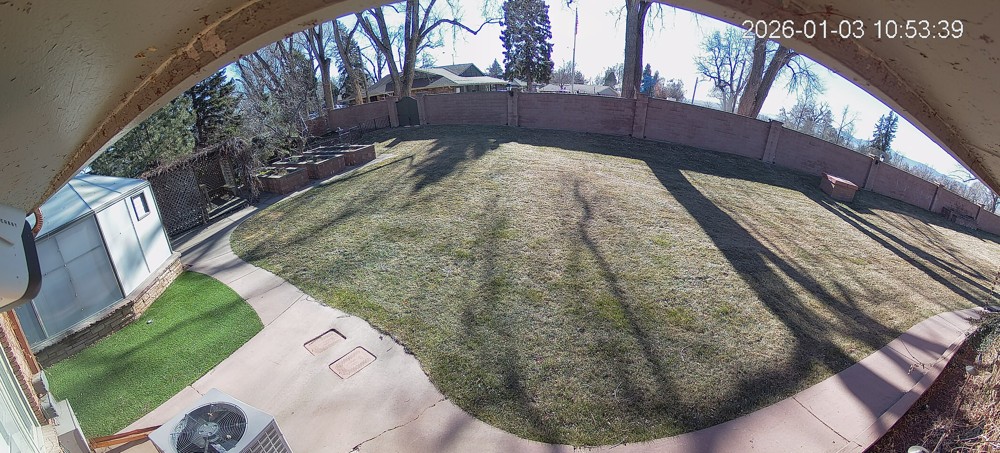

| Property | Value |
|----------|-------|
| **IP Address** | 192.168.20.33 |
| **Model** | IP8M-DLB2998EW-AI |
| **Priority** | P0 |
| **Detection** | ✅ Enabled |

**Frigate Runtime:** ⚠️ camera_fps=1.0, process_fps=0.5, skipped=0.5 (50%), detection_fps=5.3

#### Encoder Configuration (from Amcrest API)

| Stream | Resolution | FPS | Bitrate | Codec | GOP | Enabled |
|--------|------------|-----|---------|-------|-----|---------|
| Main (Day) | 4096x1856 | 15 | 10240 kbps | H.264 | 15 | ✅ |
| Main (Night) | 4096x1856 | 15 | 10240 kbps | H.264 | 15 | ✅ |
| Sub1 (Day) | 640x480 | 5 | 384 kbps | H.264 | 5 | ✅ |
| Sub1 (Night) | 704x480 | 5 | 512 kbps | H.264 | 5 | ✅ |
| Sub2 (Day) | 704x480 | - | 1024 kbps | H.264 | - | ❌ |

**Video Color:** Brightness=50, Contrast=50, Saturation=50, Gamma=50, Hue=50, Style=Standard

**Exposure Settings:** Mode=Auto, WhiteBalance=Auto, DayNight=Auto, Backlight=Off

#### Scene Analysis

**Overview:** monitors a large, enclosed backyard area with clear views of all main access points and open spaces. The wide-angle lens captures most of the yard, but there are minor blind spots near the building and extreme frame edges. Security could be enhanced with additional lighting and a secondary camera for full perimeter coverage.

**Camera Position:** The camera is mounted under the eaves of a building, likely at a height of 8–10 feet.

**Field of View:** Wide-angle coverage; nearly the entire south yard is visible from left to right fence line. **Blind spots:** The far right edge and areas directly below the camera are not visible.

**Entry/Exit Points:** Large double gate in the rear fence ; Side gate/doorway near the lattice structure ; Walkway leading from the house/building into the yard

**Priority Detection Zones:** Rear double gate : Main external access point; Side gate/doorway : Secondary access; Walkway/path from house to yard

**Security Assessment:** Good. Recommendations: Adjust detection zones to minimize false alerts from tree movement and shadows


---

### southyard_2

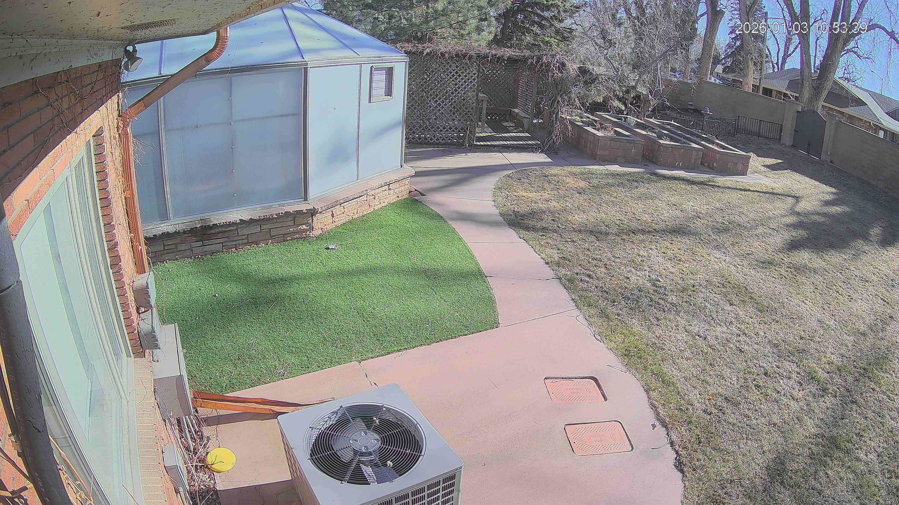

| Property | Value |
|----------|-------|
| **IP Address** | 192.168.20.175 |
| **Model** | IP8M-2496E-V2 |
| **Priority** | P2 |
| **Detection** | ✅ Enabled |

**Frigate Runtime:** ✅ camera_fps=1.1, process_fps=1.0, skipped=0.0 (0%), detection_fps=5.0

#### Encoder Configuration (from Amcrest API)

| Stream | Resolution | FPS | Bitrate | Codec | GOP | Enabled |
|--------|------------|-----|---------|-------|-----|---------|
| Main (Day) | 3840x2160 | 15 | 6144 kbps | H.264 | 15 | ✅ |
| Main (Night) | 3840x2160 | 15 | 6144 kbps | H.264 | 15 | ✅ |
| Sub1 (Day) | 704x480 | 5 | 512 kbps | H.264 | 5 | ✅ |
| Sub1 (Night) | 1280x720 | - | 1024 kbps | H.264 | - | ❌ |
| Sub2 (Day) | 704x480 | - | 1024 kbps | H.264 | - | ❌ |

**Video Color:** Brightness=50, Contrast=50, Saturation=50, Gamma=50, Hue=50, Style=Standard

**Exposure Settings:** Mode=Auto, WhiteBalance=Auto, DayNight=Auto, Backlight=Off

#### Scene Analysis

**Overview:** monitors a wide section of the south yard, including the walkway, greenhouse, garden beds, and rear gate. The camera is well-placed for general surveillance but could benefit from additional coverage near the house and the gate for optimal security.

**Camera Position:** The camera is mounted on the exterior wall of a brick building, likely at a height of 8–10 feet.

**Field of View:** Wide-angle coverage, spanning from the house wall on the left to the far fence and gate on the right. **Blind spots:** The left edge (side of the house) is a blind spot.; The area directly beneath the camera is not visible.

**Entry/Exit Points:** Gate in the rear fence; Walkway leading from the house to the yard and garden areas; Potential access to the greenhouse/shed

**Priority Detection Zones:** Walkway from the house to the gate; Gate in the rear fence; Around the greenhouse/shed

**Security Assessment:** Good. Recommendations: Ensure the exterior light is functional for night coverage


---

### southyard_3

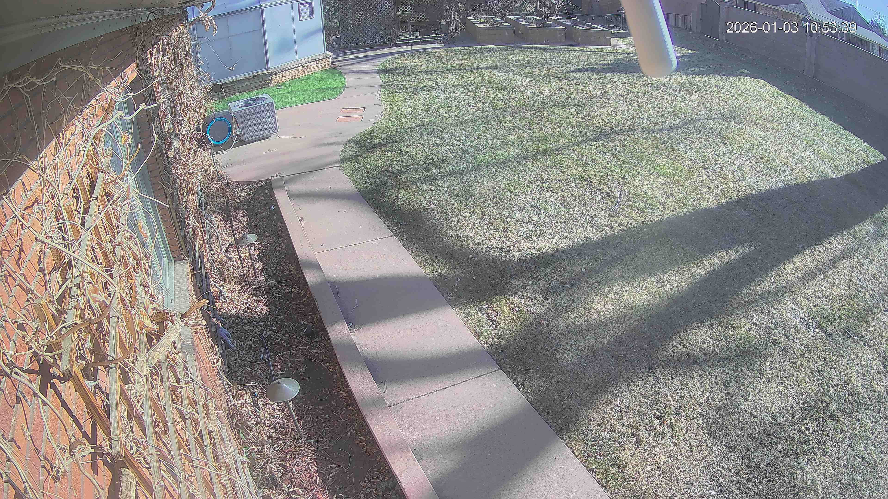

| Property | Value |
|----------|-------|
| **IP Address** | 192.168.20.188 |
| **Model** | IP8M-2496E-V2 |
| **Priority** | P2 |
| **Detection** | ✅ Enabled |

**Frigate Runtime:** ⚠️ camera_fps=1.0, process_fps=0.8, skipped=0.2 (20%), detection_fps=5.4

#### Encoder Configuration (from Amcrest API)

| Stream | Resolution | FPS | Bitrate | Codec | GOP | Enabled |
|--------|------------|-----|---------|-------|-----|---------|
| Main (Day) | 3840x2160 | 15 | 6144 kbps | H.264 | 15 | ✅ |
| Main (Night) | 3840x2160 | 15 | 6144 kbps | H.264 | 15 | ✅ |
| Sub1 (Day) | 704x480 | 5 | 512 kbps | H.264 | 5 | ✅ |
| Sub1 (Night) | 1280x720 | - | 1024 kbps | H.264 | - | ❌ |
| Sub2 (Day) | 704x480 | - | 1024 kbps | H.264 | - | ❌ |

**Video Color:** Brightness=50, Contrast=50, Saturation=50, Gamma=50, Hue=50, Style=Standard

**Exposure Settings:** Mode=Auto, WhiteBalance=Auto, DayNight=Auto, Backlight=Off

#### Scene Analysis

**Overview:** monitors the southern side yard, capturing the walkway, lawn, and key structures. It is well-positioned for general surveillance but could benefit from additional coverage near the building and entry points for optimal security.

**Camera Position:** The camera is mounted on the exterior wall of a brick building, likely at a height of 8–10 feet.

**Field of View:** Medium to wide angle; covers the side yard from the building wall to the far fence line, including a curved walkway and a large grassy area.

**Entry/Exit Points:** Walkway leading toward the back of the yard; Possible gate at the far end of the yard

**Priority Detection Zones:** Walkway; Gate/fence area; Around the HVAC unit and raised beds

**Security Assessment:** Good


---

### storageyard_1

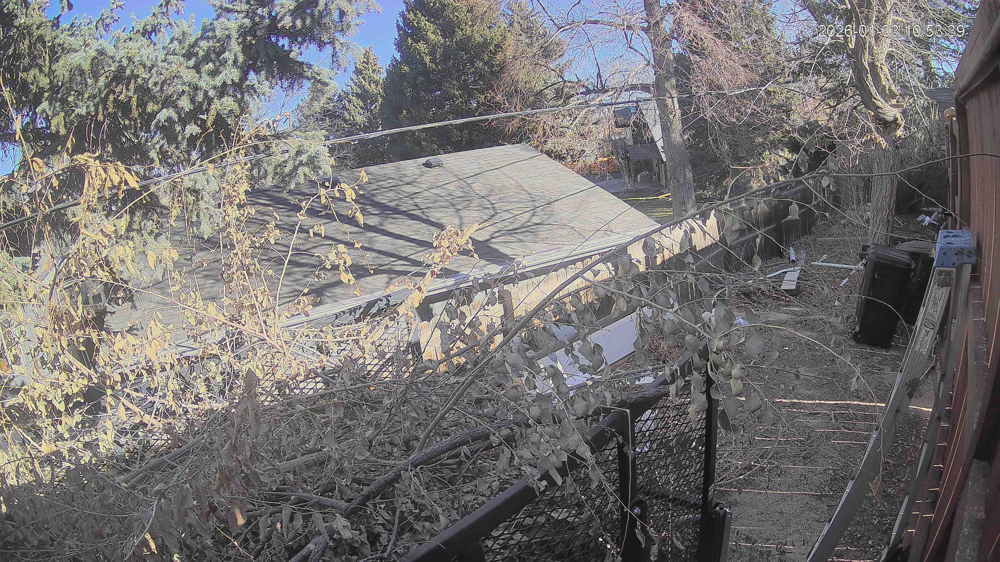

| Property | Value |
|----------|-------|
| **IP Address** | 192.168.20.18 |
| **Model** | IP8M-2496E-V2 |
| **Priority** | P2 |
| **Detection** | ✅ Enabled |

**Frigate Runtime:** ✅ camera_fps=1.0, process_fps=1.0, skipped=0.0 (0%), detection_fps=1.7

#### Encoder Configuration (from Amcrest API)

| Stream | Resolution | FPS | Bitrate | Codec | GOP | Enabled |
|--------|------------|-----|---------|-------|-----|---------|
| Main (Day) | 3840x2160 | 15 | 6144 kbps | H.264 | 15 | ✅ |
| Main (Night) | 3840x2160 | 15 | 6144 kbps | H.264 | 15 | ✅ |
| Sub1 (Day) | 704x480 | 5 | 512 kbps | H.264 | 5 | ✅ |
| Sub1 (Night) | 1280x720 | - | 1024 kbps | H.264 | - | ❌ |
| Sub2 (Day) | 704x480 | - | 1024 kbps | H.264 | - | ❌ |

**Video Color:** Brightness=50, Contrast=50, Saturation=50, Gamma=50, Hue=50, Style=Standard

**Exposure Settings:** Mode=Auto, WhiteBalance=Auto, DayNight=Auto, Backlight=Off

#### Scene Analysis

**Overview:** a narrow, fenced side or rear yard used for storage, with good daytime visibility but some obstructions from vegetation. The camera is well-placed for detecting unauthorized access or activity along the fence and near stored items, but would benefit from vegetation management and enhanced lighting for optimal security.

**Camera Position:** The camera appears to be mounted at a medium to high elevation, likely attached to the side of a building or fence, angled downward.

**Field of View:** Medium angle—captures the width of a narrow yard or storage corridor, running parallel to a fence and building.

**Entry/Exit Points:** The fence may have a gate out of frame

**Priority Detection Zones:** Along the fence line; Near the storage items; **Areas to Mask:**

**Security Assessment:** Good. Recommendations: Install motion-activated lighting for better night visibility


---

### storageyard_2

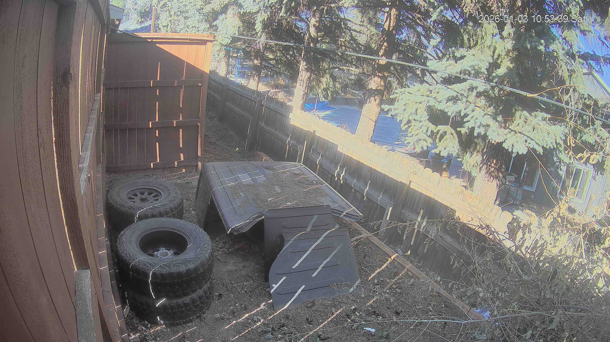

| Property | Value |
|----------|-------|
| **IP Address** | 192.168.20.117 |
| **Model** | IP8M-2496E-V2 |
| **Priority** | P2 |
| **Detection** | ✅ Enabled |

**Frigate Runtime:** ✅ camera_fps=1.1, process_fps=1.1, skipped=0.0 (0%), detection_fps=0.0

#### Encoder Configuration (from Amcrest API)

| Stream | Resolution | FPS | Bitrate | Codec | GOP | Enabled |
|--------|------------|-----|---------|-------|-----|---------|
| Main (Day) | 3840x2160 | 15 | 6144 kbps | H.264 | 15 | ✅ |
| Main (Night) | 3840x2160 | 15 | 6144 kbps | H.264 | 15 | ✅ |
| Sub1 (Day) | 704x480 | 5 | 512 kbps | H.264 | 5 | ✅ |
| Sub1 (Night) | 1280x720 | - | 1024 kbps | H.264 | - | ❌ |
| Sub2 (Day) | 704x480 | - | 1024 kbps | H.264 | - | ❌ |

**Video Color:** Brightness=50, Contrast=50, Saturation=50, Gamma=50, Hue=50, Style=Standard

**Exposure Settings:** Mode=Auto, WhiteBalance=Auto, DayNight=Auto, Backlight=Off

#### Scene Analysis

**Overview:** monitors a narrow storage yard or side yard, focusing on stored items and a potential access gate. The camera is well-positioned for daytime monitoring but would benefit from improved lighting and additional coverage at the far end for optimal security.

**Camera Position:** The camera is mounted on the exterior wall of a wooden structure (likely a shed or outbuilding), approximately 7–9 feet above ground level.

**Field of View:** Medium angle; the camera covers a narrow, elongated strip of yard running parallel to the fence. **Blind spots:** The far end (behind the stacked items and fence) is partially obscured.

**Entry/Exit Points:** A wooden gate or fence panel at the far end of the yard ; No doors or gates visible on the left wall

**Priority Detection Zones:** The gate/fence panel at the far end ; The area immediately adjacent to the building ; **Areas to Mask:**

**Security Assessment:** Good. Recommendations: Add motion-activated lighting for night coverage


---

### storageyard_powerwall

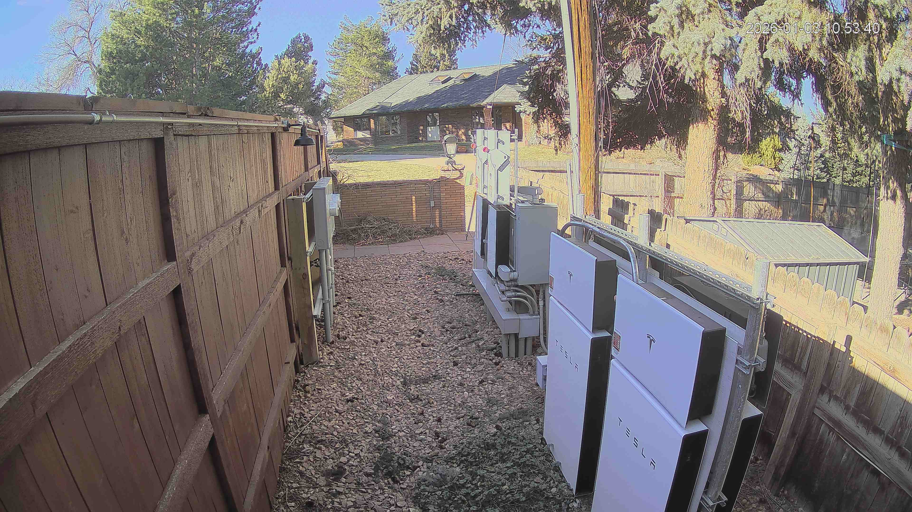

| Property | Value |
|----------|-------|
| **IP Address** | 192.168.20.32 |
| **Model** | IP8M-2496E-V2 |
| **Priority** | P2 |
| **Detection** | ❌ Disabled |

**Frigate Runtime:** ✅ camera_fps=1.0, process_fps=1.0, skipped=0.0 (0%), detection_fps=0.0

#### Encoder Configuration (from Amcrest API)

| Stream | Resolution | FPS | Bitrate | Codec | GOP | Enabled |
|--------|------------|-----|---------|-------|-----|---------|
| Main (Day) | 3840x2160 | 15 | 6144 kbps | H.264 | 15 | ✅ |
| Main (Night) | 3840x2160 | 15 | 6144 kbps | H.264 | 15 | ✅ |
| Sub1 (Day) | 704x480 | 5 | 512 kbps | H.264 | 5 | ✅ |
| Sub1 (Night) | 1280x720 | - | 1024 kbps | H.264 | - | ❌ |
| Sub2 (Day) | 704x480 | - | 1024 kbps | H.264 | - | ❌ |

**Video Color:** Brightness=50, Contrast=50, Saturation=50, Gamma=50, Hue=50, Style=Standard

**Exposure Settings:** Mode=Auto, WhiteBalance=Auto, DayNight=Auto, Backlight=Off

#### Scene Analysis

**Overview:** camera is strategically positioned to monitor a utility/service area containing Tesla Powerwall battery units and associated electrical infrastructure. It covers the approach to a residential building and provides visibility of key assets. The scene is well-lit during the day, but may require additional lighting for night security. The coverage is good, but could be improved with additional cameras to eliminate blind spots and enhance overall security.

**Camera Position:** The camera appears to be mounted at a medium height (approx. 7–8 feet), likely attached to the side of a wooden fence or utility pole.

**Field of View:** Medium to narrow angle, focused on a specific utility/service area rather than a wide yard or open space.

**Entry/Exit Points:** Pathway leading from the utility area up to the house

**Priority Detection Zones:** The area immediately around the Powerwall units; Pathway leading up to the house; **Areas to Mask:**

**Security Assessment:** Good


---

## Data Collection Notes

This documentation was auto-generated by querying:

1. **Amcrest CGI API** - `configManager.cgi` for encoder, video color, and exposure settings
2. **Frigate API** - `/api/stats` for runtime metrics and detection status
3. **SQLite manifest.db** - Camera inventory with IPs, models, and priorities
