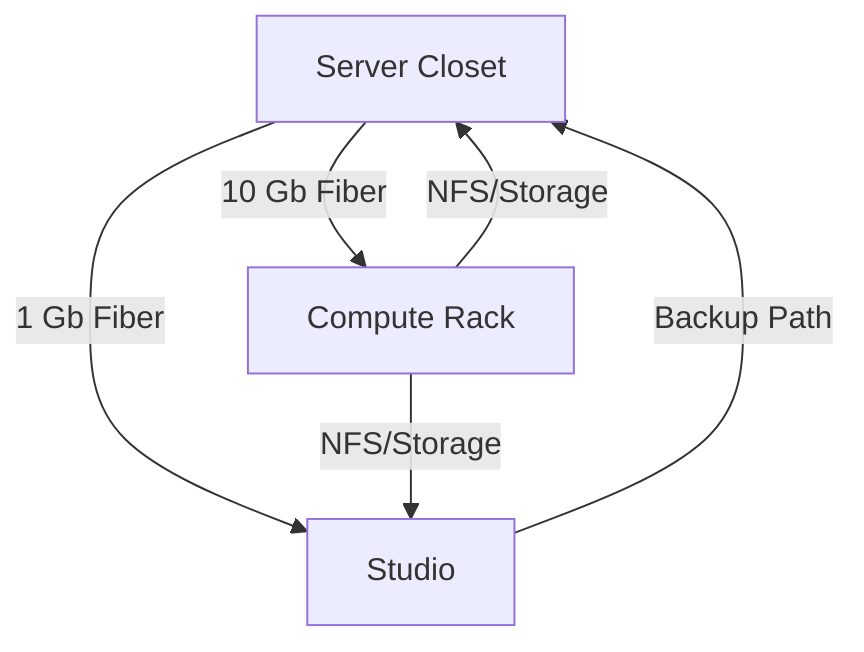

# Room Layout

← [Documentation Index](../index.md)

## Physical Infrastructure Layout

### Server Closet – Main House

**Location**: Off the family room
**Purpose**: Core networking and primary management node

**Equipment**:
- UniFi UDM-Pro Max
- Core switches (10 Gb backbone)
- home1 (primary manager node)
- IoT device hubs (Lutron, Zigbee, Hue)

**Power**:
- 20 AMP from "Main House" meter (PowerWall+ backed)
- 20 AMP from "Pool Pumps and GPU" meter (unused backup)
- 3x CyberPower OR500LCDRM1U UPS units

**Connectivity**:
- Main fiber ingress point
- PoE distribution for cameras and APs
- 10 Gb backbone to basement rack

### Compute Rack – Basement of Main House

**Location**: Basement work room
**Purpose**: Primary compute and storage cluster

**Equipment**:
- oro, opal, onyx (GPU workers)
- home2 (manager node)
- obsidian (Synology NAS)

**Storage**:
- `/data` mount on mdadm mirror of two NVMe plus spare per host
- NFS exports from obsidian to all cluster nodes

**Power**:
- 1 outlet providing 20 AMPs from "Main House" (PowerWall+ backed)
- 1 outlet providing 20 AMPs from "Suite" (PowerWall+ backed)
- 3 outlets (20 amp each) from "Pool Pumps and GPUs" (non-backed)
- CyberPower OR2200LCDRT2U UPS (2200VA/1320W)

**Expansion**: Adjacent to pool mechanical room for future 400 amp upgrade

### Studio – Suite Side

**Location**: Off the suite
**Purpose**: Secondary network and IoT redundancy

**Equipment**:
- home3 (manager node)
- UniFi PoE switch for local cameras/APs
- Second set of IoT hubs (Lutron, Zigbee, Hue) for redundancy

**Power**:
- 200 AMP panel from "Suite" meter (PowerWall+ backed circuits)
- 200 AMP panel from "Garage" meter (non-backed circuits)
- 200 AMP panel empty for future use
- CyberPower OR500LCDRM1U UPS

### Pool Mechanical Room – Main House

**Location**: Adjacent to basement compute rack
**Purpose**: Power distribution and future expansion

**Power Panels**:
- **100 AMP** – Fed by meter 2 "Suite" PowerWall+ side
  - Powers lighting circuits and outlets for pool and family room addition
- **200 AMP** – Fed by "Pool Pumps and GPU" Tesla system
  - Powers swimming pool pumps and feeds the basement server rack
- **200 AMP** – Wired and installed, no circuits landed (future use)

## Room-to-Room Connectivity

## Environmental Considerations

- **Cooling**: Basement location provides natural cooling for compute equipment
- **Access**: All rooms have 24/7 physical access
- **Expansion**: Conduit runs installed for future cabling needs
- **Fire Protection**: Smoke detectors in all equipment areas with home automation integration

---

**Next**: [Host Mapping](host-map.md) | **Related**: [Power Systems](power.md)
