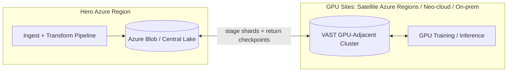
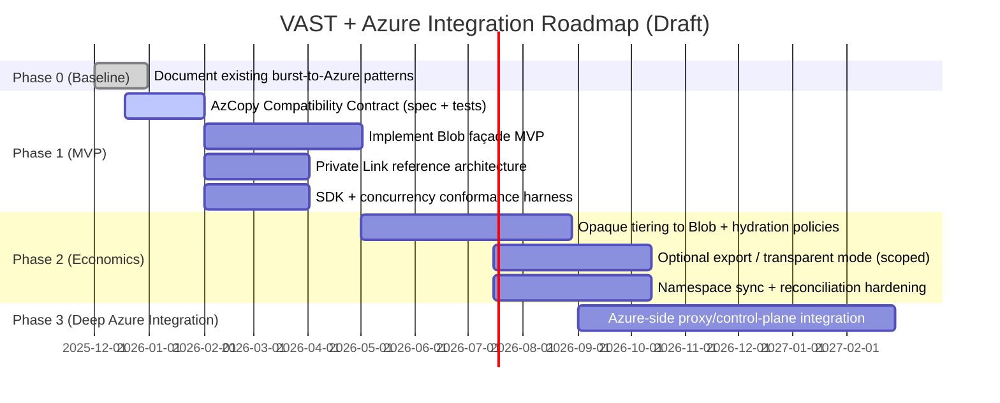
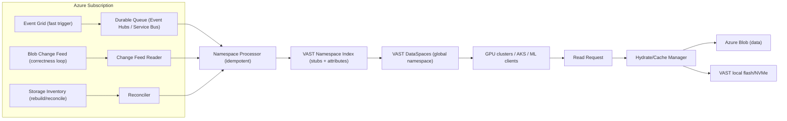

# VAST + Microsoft Azure Integration

**Strategy, Architecture, and Roadmap**  
**Draft v1.0 — 2025-12-18**


## Executive overview

### Directional stance

Do **not** build “VAST-as-Blob” as the product goal. Build VAST as:

- the **GPU-adjacent performance tier**,
- the **global namespace / DataSpaces fabric**, and
- the **high-performance multi-protocol gateway** for AI pipelines,

while **Azure Blob remains the system-of-record capacity tier** and the ecosystem gravity well.

This integration succeeds if customers can:

1. **Stage** training data from central Azure lakes to GPU-adjacent VAST **fast and safely**.
2. **Push checkpoints and artifacts back** to the central estate reliably.
3. Keep using **Azure-native services and tooling** (without refactoring) **where it matters**.


**What:** A set of integration patterns that connect **Blob-centric Azure data estates** to **distributed GPU-adjacent VAST clusters** running on (a) optimized hardware using (b) a minimal **Blob REST façade** on VAST for Azure-native movers, plus (c) optional **tiering and namespace synchronization** to reduce TCO and avoid silos.

**Why:** AI/HPC is becoming a **distributed compute** problem (GPUs wherever power exists) while data remains a **centralized governance/economics** problem (multi-exabyte lakes). VAST + Azure reconciles the two without forcing customer refactors.

**How:**

- **Phase 1:** Blob facade MVP anchored on an **AzCopy Compatibility Contract** (AzCopy workflows succeed without code changes; configuration changes allowed).
- **Phase 2:** Add **tiering/offload to Blob** (opaque-by-default), with an optional export mode for ecosystem needs.
- **Phase 3:** Pursue deeper Azure-native integration for services that can’t point at arbitrary endpoints (control-plane bindings), likely via Azure-side proxy patterns (Tuscany) and/or joint engineering.

### Success metrics

**Phase 1 (MVP) success metrics**

- **Time-to-stage** N TB of training data to a GPU-adjacent site (P50/P95).
    
- **Checkpoint round-trip time** (GPU → VAST → central Blob) at target cadence.
    
- **No-refactor** mover success: AzCopy-based workflows succeed with documented configuration.
    
- **Security posture:** private networking supported for enterprise deployments (Private Link patterns).
    

**Phase 2+ (product) success metrics**

- **Working set economics:** policy-driven offload to Blob reduces flash footprint while maintaining GPU throughput.
    
- **Operational simplicity:** unified observability, predictable failure modes, clear support boundaries.
    
- **Ecosystem integration depth:** number of Azure services that can access data without bespoke glue (by pattern class).
    

### Non-goals (explicit)

- Not building full Blob feature parity (Append Blobs, Page Blobs, full long-tail).
    
- Not implementing full ADLS Gen2 / HNS / DFS endpoint parity in the MVP.
    
- Not turning VAST into a “Blob storage account replacement.”
    
- Not promising universal “Azure service compatibility” via a VM-hosted endpoint in Phase 1.
    

---

## Integration thesis

### Positioning

**Azure is the:**

- ecosystem control plane,
    
- security/governance anchor,
    
- and cost-effective capacity substrate.
    

**VAST is the:**

- GPU-adjacent performance tier,
    
- global namespace / data spaces fabric,
    
- and high-performance multi-protocol gateway for AI pipelines.
    

The partnership wins when it enables:

> **Centralize governance and durability in Azure; decentralize performance to wherever GPUs exist.**

### Why now

- **Distributed GPU reality:** GPUs are landing where power and supply allow, not necessarily where the central lake is.
    
- **Tooling inertia:** Azure-native movement and orchestration standardize on AzCopy-like primitives; customers resist refactors.
    
- **Ecosystem adjacency:** Fabric and OneLake are becoming the “data UX.” Fabric supports S3-compatible shortcuts, which creates a low-friction analytics touchpoint for VAST’s S3 endpoint.
    
- **Partnership momentum:** VAST + Microsoft publicly position “VAST AI OS” on Azure for hybrid/multi-cloud “agentic AI” workflows.
    

### Design principles (opinionated)

1. **Blob stays system-of-record.** VAST is the performance tier and fabric, not the lake replacement.
    
2. **Compatibility over completeness.** Implement the smallest Blob surface that unlocks real Azure tooling.
    
3. **Private-by-default.** Enterprise adoption requires private connectivity patterns.
    
4. **Authority by prefix.** For federation/sync, pick an authority per prefix; do not attempt unconstrained bidirectional writes in early phases.
    
5. **Ship a test harness, not just an API.** Compatibility is defined by tools and SDKs, not by a marketing surface.
    

---

## Target scenarios and TAM

### Customer archetypes

This integration is aimed at AI/HPC organizations with **centralized data governance** and **distributed compute**. Three common archetypes:

1. **Frontier / “OpenAI/MicrosoftAI-style” training pipelines**
    
    - Massive centralized curated datasets
        
    - Distributed GPU training clusters across regions/providers
        
    - Heavy checkpoint cadence and artifact flows
        
2. **MAI-style / platform-scale AI within a large enterprise**
    
    - Central data lake and governance
        
    - Multiple internal GPU fleets (Azure regions + on-prem + partner capacity)
        
    - Strong security posture requirements (private networking, zero trust)
        
3. **Enterprise “AI factory” and HPC modernization**
    
    - Existing Azure Blob/ADLS estates
        
    - GPUs added incrementally; mixed vendor/tooling
        
    - Strong preference for “no-refactor” adoption
        

### Target scenarios (north stars)

- **Central Blob lake → GPU-adjacent VAST staging** (fast training starts; minimal refactor)
    
- **GPU checkpoints → central Blob** (durable, governed artifact capture)
    
- **VAST as performance tier + Blob as capacity tier** (long-term economics)
    
- **Fabric/analytics access** without forcing Blob emulation (use S3 shortcut path where it fits)
    
- **Cross-region distributed training** using global namespace + replication patterns
    

### TAM framing (method, not a number)

This document intentionally avoids an ungrounded TAM number. TAM should be quantified using customer-validated inputs:

- **Storage TAM component:** capacity governed in Blob/ADLS and adjacent performance tiers
    
- **Mover TAM component:** annual TB migrated/staged and recurring sync volume
    
- **Compute adjacency TAM component:** GPU cluster scale and utilization impact from I/O improvements
    
- **Service adoption TAM component:** number of Azure services used that are “storage-account-bound” vs “endpoint-configurable”
    

**Action:** quantify top 3 pipelines (data volumes, object size distributions, concurrency, checkpoint patterns) and convert to:

- GPU idle cost avoided
    
- incremental performance-tier capacity required
    
- offload/tiering savings and egress implications
    

---

## Target workloads and end-to-end flows

Each workload includes: problem, topology, flow, integration touchpoints, MVP definition, deferrals, and KPIs.

### W0 — On‑prem VAST + burst compute on Azure (baseline strength)

**Problem:** compute bursts to Azure while dataset remains on-prem; customers need consistent namespace and performance.  
**Topology:** On-prem VAST ↔ VAST-on-Azure endpoints (cache + protocol termination) ↔ Azure compute.  
**Primary protocols:** NFS and S3.

**MVP stance:** Already viable (“Phase 0”). Document and standardize reference architecture.

**Integration touchpoints:**

- DataSpaces/global namespace between clusters
    
- WAN optimization and caching behavior
    
- Security and identity patterns
    

**Research:** baseline cost/perf envelope and when VM-based model breaks (capacity economics).

---

### W1 — Central Azure Blob lake + GPU-adjacent VAST clusters (primary focus)

**Problem:** centralized multi-exabyte Blob lake in a hero region; GPUs distributed across satellite regions/neo-cloud/on-prem. Need fast staging and checkpoint synchronization with no refactoring.  
**Primary requirement:** data movement and orchestration that reuses Azure-native tooling.

**Canonical training flow**



**MVP stance:** This is the core reason the Blob façade exists. Not to replace Blob, but to make movement frictionless.

**Integration touchpoints:**

- Azure-native mover primitives → VAST Blob façade
    
- Optional VAST S3/NFS for compute adjacency
    
- Private networking and scoped access
    
- Audit logs and operational visibility
    

**KPIs:** stage time, checkpoint round-trip latency, throughput under concurrency, failure/retry behavior.

---

### W2 — Tiering/offload from VAST to Azure Blob (economics and scale)

**Problem:** VAST is high-performance flash; customers need low-cost capacity tier for cold data, retention, and dataset history.  
**Topologies:** GPU-adjacent VAST at sites + optional central VAST + Blob as capacity substrate.

**Decision fork:** opaque vs transparent tiering (see Appendix D).

**MVP stance:** Phase 2, paired with a narrow/defensible scope.

**Research:** percentage of working set vs cold set in target AI factories; hydration penalties; DRR distribution by dataset type.

---

### W3 — “Azure ecosystem access” (services still think they’re using Blob)

**Problem:** many Azure services bind to storage via control plane (“pick a storage account”), not via arbitrary endpoints. Direct endpoint substitution often fails.  
**Implication:** broad Azure service compatibility is not a Phase 1 promise.

**MVP stance:**

- Do not promise broad “Azure service compatibility” via Blob emulation in Phase 1.
    
- Do:
    
    1. enable Fabric access through S3-compatible shortcuts (fast win), and
        
    2. pursue Azure-side proxy/control-plane integration as a joint roadmap item (Phase 3).
        

**Research:** service-by-service matrix: “endpoint-configurable” vs “storage-account-only”.

---

### W4 — RAG / in-place vector + event-driven agentic pipelines

**Problem:** customers want RAG grounding and agentic workflows without duplicative data pipelines.  
**Integration:** VAST in-place services (InsightEngine/AgentEngine/DataEngine) + Azure OpenAI / AI Foundry as model endpoints and orchestration layers.

**MVP stance:** solution pattern + reference architecture; do not over-claim first-party integration.

**Research:** clarify what’s product capability vs solution assembly; define event contract (schemas, guarantees).

---

### Additional opportunities (worth capturing)

**Cross-region global namespace on Azure backbone**

- Example: training in West US 3, lake in East US 2
    
- VAST instances in each region, synchronized via DataSpaces replication
    
- Value: avoids blunt “copy everything everywhere” approaches
    

**Fleet management across tenants (Azure Lighthouse candidate)**

- Central operations for many clusters across subscriptions/tenants
    
- Validation required: best-fit Azure primitives and packaging for delegated management
    

---

## Integration architecture and patterns

This section describes the integration as a pattern library so it scales to 100+ services without becoming unreadable.

### Pattern library (P1–P8)

#### P1 — File semantics for compute: NFS/SMB

Use when: training/inference code expects POSIX paths; many small files; shared RWX semantics.  
Applies to: AKS nodes, AML compute (when VNet-injected), HPC VMs, Azure Batch.

**Validation:** per-service ability to mount NFS/SMB under its network model.

---

#### P2 — Object semantics: S3

Use when: tools are S3-native; Fabric shortcut path; Databricks S3A patterns; OSS ecosystem.  
Applies to: Fabric, Databricks, many open-source tools.

**Fabric constraint:** S3 shortcut auth is key/secret-style; Entra OAuth is not supported for that connection type (see Appendix F references).

---

#### P3 — Blob façade on VAST (AzCopy compatibility MVP)

Use when: you must reuse Azure tooling and data movement engines without refactoring.

Core principle: treat **AzCopy as the spec**. Implement the minimum Blob REST surface AzCopy uses for copy/sync patterns and match semantics closely enough that it “just works.”

Why S3 is not enough: AzCopy’s S3 support is AWS URL-pattern specific and historically rejects other S3 providers/endpoints (see Appendix F references). Blob compatibility is the pragmatic path for Azure-native movers.

---

#### P4 — Tiering/offload to Blob

Two sub-patterns:

- **P4a Opaque:** VAST-native extents stored in Blob (best economics/DRR; Blob not directly usable)
    
- **P4b Transparent:** Blob-native objects remain canonical; VAST indexes/caches/stages (ecosystem-friendly; more complexity)
    

Hybrid is recommended: opaque-by-default; transparent for explicitly required datasets.

---

#### P5 — Namespace & metadata synchronization (Change Feed + reconciliation)

Use when: VAST needs to mirror Blob namespace or detect changes for cache invalidation.

Recommended: Change Feed as authoritative stream where supported + periodic reconciliation; avoid relying solely on event triggers for correctness. HNS (ADLS Gen2) accounts impose constraints (see Appendix C).

---

#### P6 — Azure-side reverse proxy (Blob → external object store)

Use when: Azure services must remain Blob-native in control plane, but data lives elsewhere.  
This is likely Microsoft-dependent (Phase 3) and should be treated as joint roadmap.

---

#### P7 — Eventing integration (VAST ↔ Event Grid / Functions / Foundry)

Use when: storage events drive AI/ETL workflows.

Define canonical event schema and delivery semantics; document “at-least-once” realities; provide reconciliation path.

---

#### P8 — Networking & security posture (Private Link, isolation)

Use when: enterprise adoption requires private-only access.

Preferred pattern: publish VAST endpoints via Private Link Service (PLS) for scalable private consumption without VNet peering. Document approval workflows and DNS patterns. Address managed VNet constraints explicitly (Fabric/Synapse/ADF patterns).

---

## Integration points and service alignment

### Integration surface area inventory (coverage map)

| Layer              | Integration point             | Examples                                      | Notes                                                                    |
| ------------------ | ----------------------------- | --------------------------------------------- | ------------------------------------------------------------------------ |
| Data plane         | Protocol endpoints            | NFS/SMB/S3 today; Blob API façade proposed    | Blob façade is compatibility-driven, not a new “Blob product”            |
| Data movement      | Movers + server-side copy     | AzCopy, Storage Mover-like primitives         | AzCopy uses Put Blob From URL and/or Put Block From URL + Put Block List |
| Metadata/namespace | Change log + indexing         | Change Feed, Event Grid, reconciliation       | Change Feed is a durable log; events are triggers                        |
| Identity/auth      | AuthN/Z                       | Entra ID, SAS, Shared Key                     | MVP must choose a limited but real set                                   |
| Networking         | Private connectivity          | Private Link / Private Link Service           | Private-only must be possible                                            |
| Security perimeter | Exfiltration prevention       | Network Security Perimeter, private endpoints | VAST is not an NSP resource but must interoperate with NSP-secured deps  |
| Control plane      | Resource provider integration | “Pick a storage account” UX                   | Often Microsoft work                                                     |
| Ops                | Observability & lifecycle     | Telemetry, upgrade, support                   | VAST Uplink exists; align to Azure Monitor patterns where possible       |

### Managed network reality: four connectivity patterns

#### Pattern A — Customer VNet data-plane integration (easy path)

Compute runs in customer VNet (or VNet-injected). Use peering/routing or PLS.  
Note: PLS traffic is NAT’d; if original client IP is needed for auditing, consider Proxy Protocol v2 patterns.

#### Pattern B — Managed VNet + managed private endpoints (the “Azure-native wall”)

Service runs in Microsoft-managed network and expects managed private endpoints to supported resources; often requires resource IDs/aliases, not arbitrary FQDNs.

#### Pattern C — Gateway / self-hosted runtime bridge

Use a bridge when managed VNet blocks direct connectivity:

- Fabric on-premises data gateway shortcuts
    
- ADF self-hosted Integration Runtime / similar patterns
    

#### Pattern D — Control-plane binding vs data-plane binding

If a service requires a storage account selection via the portal, it will not “see” a third-party endpoint without Microsoft control-plane support.

---

### Azure service integration matrix (prioritized top slice)

**Legend**

- **Binding model:** Control-plane (Resource ID / picker) vs data-plane (endpoint URL/creds)
    
- **Network model:** Customer VNet/VNet-injected vs Managed VNet
    
- **Feasibility:** Works now / VAST work / Microsoft work
    
- **Approval required:** whether an explicit PE/PLS approval workflow is required
    

| Azure service                        | Binding model                                                                | Network model                  | Private connectivity                                                              | VAST integration path                                                                                                | Feasibility              | Approval required                                   |
| ------------------------------------ | ---------------------------------------------------------------------------- | ------------------------------ | --------------------------------------------------------------------------------- | -------------------------------------------------------------------------------------------------------------------- | ------------------------ | --------------------------------------------------- |
| Microsoft Fabric (OneLake shortcuts) | Data-plane shortcut model                                                    | Managed                        | Managed private endpoints for supported resources; gateway for restricted sources | Use VAST S3 via S3-compatible shortcut; if endpoint is restricted/behind firewall, use on-prem data gateway shortcut | High (pattern-dependent) | Often yes (managed endpoint approvals / allow list) |
| Azure AI Foundry                     | Control-plane for dependent resources; workload networking varies            | Hybrid                         | Private Link for hubs/projects                                                    | Treat Foundry’s default storage as control-plane; mount VAST via NFS/S3 at compute layer where workloads run         | Medium                   | Yes (for private link resources)                    |
| Azure Machine Learning               | Often storage-account-bound in workspace; compute can be in customer network | Hybrid                         | Private endpoints and VNet injection options                                      | Mount VAST NFS/S3 on compute nodes in customer VNet; avoid assuming VAST can be selected as “storage account”        | Medium–High              | Depends                                             |
| Azure Databricks (Classic)           | Data-plane (external endpoints)                                              | Customer VNet (VNet injection) | Private endpoint and VNet features                                                | Use VAST S3/S3A or native connectors; keep clusters in VNet for private access                                       | High                     | Depends                                             |
| Azure Databricks (Serverless)        | Managed compute plane patterns                                               | Managed/Hybrid                 | Requires explicit serverless networking controls                                  | Treat as managed-network client; plan for private connectivity via Databricks serverless network security model      | Medium (validate)        | Likely                                              |
| AKS                                  | Data-plane (CSI/NFS/S3 clients)                                              | Customer VNet                  | Private cluster options                                                           | VAST CSI driver / NFS PVs; VNet peering or PLS                                                                       | High                     | No/optional                                         |
| Azure Data Factory                   | Control-plane + IR model                                                     | Managed/Hybrid                 | Managed VNets and private endpoints; self-hosted IR                               | Use self-hosted IR inside VAST-connected network for third-party endpoints                                           | Medium                   | Often yes                                           |
| Azure Synapse                        | Control-plane linked services; managed workspace networking                  | Managed                        | Managed private endpoints                                                         | Prefer ingest/bridge patterns; direct third-party endpoints are constrained                                          | Low–Medium               | Yes                                                 |
| Azure Event Grid                     | Data-plane events + webhook delivery                                         | Service-managed                | Private endpoints supported for topics/domains                                    | VAST publishes to custom topics; Azure services subscribe                                                            | High                     | Depends                                             |
| Azure Functions                      | Storage triggers are storage-account-bound                                   | Hybrid                         | VNet integration / private endpoints                                              | Prefer Event Grid or HTTP/webhook integration; avoid Blob-trigger dependence for VAST                                | Medium                   | Depends                                             |
| Azure Batch                          | Pool mounts supported                                                        | Customer VNet                  | VNet configuration                                                                | Mount VAST NFS/SMB in pool                                                                                           | High                     | No                                                  |

**Service matrix expansion strategy:**  
Appendix B contains the framework and tagging scheme for building the top 25 → top 100 service matrix without losing clarity.

---

## Deployment variants and reference architectures

### Deployment variants (hardware and operational)

|Variant|Where it runs|What it’s made of|Why it exists|Constraints / watch-outs|
|---|---|---|---|---|
|V1 — GPU-adjacent VAST on ODM|Near GPUs (neo-cloud, on-prem, colo, satellite)|VAST ODM appliances (flash)|Deterministic max performance, stable ops, best adjacency|WAN back to Blob; egress; async consistency|
|V2 — VAST on Azure IaaS (L‑series v4)|Azure regions|VAST on Laosv4 / Lasv4 / Lsv4 local NVMe optimized VMs|Fast Azure “beachhead” for GPU-adjacent storage in Azure|Local NVMe lifecycle/ephemerality; quotas/availability; VM failure domains|
|V3 — VAST on Azure BareMetal Infrastructure|Supported Azure regions|Dedicated bare metal instances in customer VNet|Determinism and isolation; avoid hypervisor tax|SKU/region constrained; different ops/provisioning model|
|V4 — VAST on “Azure storage-provided hardware” (future/partner)|Azure regions|Azure-managed or co-engineered footprint + deep control-plane integration|Unlock first-party compatibility and parity|Requires Microsoft partnership and productization; not assumed in Phase 1|

**SKU stance:** treat L‑series v4 as the current center-of-gravity for Azure IaaS deployments; treat “Lasv5” as future/unknown pending confirmation.

### Reference architecture: Central Blob lake + distributed GPU-adjacent VAST

```mermaid
flowchart LR
  subgraph Hero[Hero Azure Region]
    Blob[(Azure Blob / ADLS Gen2)]
    ETL[Ingest + Transform\n(Spark/Databricks/Fabric/etc.)]
  end

  subgraph Edge[GPU Sites: Satellite Regions / Neo-cloud / On-Prem]
    VAST[VAST GPU-adjacent tier\n(V1 ODM or V2 IaaS)]
    GPUs[GPU Clusters\n(Train/Infer)]
  end

  ETL --> Blob
  Blob <--> |AzCopy-compatible movement\nPut Blob/Block From URL| VAST
  VAST <--> GPUs
  GPUs --> |Checkpoints| VAST
  VAST --> |Async sync/tier| Blob
```

### Substrate economics (DRR-driven)

DRR (data reduction ratio) determines whether flash is feasible at scale. Dataset type matters:

- Text/logs/source code: typically high redundancy → DRR helps
    
- Checkpoints: often compressed binaries → DRR may be limited
    
- Images/video/encrypted-at-source objects: low DRR → tiering to Blob becomes more important
    

Supply chain volatility (flash constraints) should be framed as a risk factor and economic driver, not the sole pillar.

---

## MVP definition: AzCopy Compatibility Contract

### MVP intent (non-negotiable)

The Blob API endpoint is not a Blob clone. It is a compatibility façade that makes existing Azure-centric data movers work without refactor for the specific staging + checkpoint flows.

**MVP contract:** AzCopy workflows work without code changes (configuration allowed). Treat AzCopy as the spec.

### Why “Blob façade” instead of “just use S3”

AzCopy’s S3 support is AWS URL-pattern specific and historically rejects other S3 providers/endpoints. Relying on “AzCopy to VAST S3” does not meet “no-refactor” requirements.

### MVP Blob operations (first-pass)

**Required for enumeration and diff**

- List Blobs (container listing)
    
- Get Blob Properties (HEAD)
    
- Get Blob (including range reads)
    

**Required for upload**

- Put Blob (single-shot for small blobs)
    
- Put Block
    
- Put Block List
    

**Required for service-to-service copy (critical)**

- Put Blob From URL
    
- Put Block From URL + Put Block List
    

**Required for delete/sync correctness**

- Delete Blob
    
- Container create/delete if workflow demands
    

### Semantics that must be correct (or explicitly documented)

|Semantic|Why movers/SDKs care|MVP stance|
|---|---|---|
|ETag and conditional headers|Sync correctness|Implement or declare a bounded deviation|
|Last-Modified|Diff and conflict detection|Implement|
|Range reads|Resume and parallel reads|Implement|
|Retryable error codes|Throughput and resilience|Match common Azure patterns|
|Block semantics|Large objects|Implement faithfully|
|Copy source auth|Server-side copy|Support signed source access; plan for `x-ms-copy-source-authorization`|

### Auth modes (MVP stance)

**Token-based auth should not be deferred** where regulated enterprise adoption requires secretless access.

Recommended support:

- **Entra ID (OAuth bearer tokens)** as a first-class path
    
- SAS + Shared Key as compatibility mode (documented tradeoffs)
    

Fabric constraint: Fabric’s S3 shortcut path uses key/secret auth and does not support Entra OAuth for that connection type.

### Compatibility and conformance harness (definition of done)

Passing AzCopy is necessary but not sufficient. The harness must include:

1. **AzCopy gate:** copy/sync scenarios, including service-to-service copies where applicable
    
2. **High-concurrency gate:** parallel Put Block and range GET patterns (boostedblob/rclone-like behavior)
    
3. **Azure SDK gate (Python):** `azure-storage-blob` end-to-end semantics (upload/download/list/errors/auth)
    

Add chaos tests:

- transient failures
    
- partial block uploads
    
- retry behavior
    
- throttling and backoff
    

**Output of Phase 1:** “AzCopy Compatibility Contract” + automated regression suite.

---

## Security, networking, and identity

### Non-negotiable: private-only access must be possible

Many enterprises will not accept “public endpoint + IP allowlist” for core data plane access.

### Recommended pattern: Azure Private Link Service for VAST endpoints

- VAST endpoints behind Standard Load Balancer
    
- Private Link Service attached
    
- Consumers create private endpoints in their VNets
    
- Private DNS zones for name resolution
    
- Document approval workflows (especially for managed-network services)
    

**Operational nuance:** PLS performs destination-side NAT to avoid IP conflicts. If original client IP is needed for audit/logging, consider Proxy Protocol v2 support patterns.

### Managed VNet constraints (Fabric/Synapse/ADF reality)

- Some managed services use managed private endpoints and require resource IDs/aliases and approval steps.
    
- When direct connectivity is blocked, the practical bridges are:
    
    - Fabric on-premises data gateway shortcuts
        
    - ADF self-hosted Integration Runtime
        
    - “proxy/control-plane integration” as a joint roadmap item
        

### Network Security Perimeter (NSP) implications

NSP creates logical isolation boundaries for PaaS resources (Storage, Key Vault) to prevent unwanted exfiltration. VAST (IaaS/VM-based) won’t be an NSP resource, but must interoperate with NSP-secured dependencies (Key Vault, etc.) where customer policy requires it.

### Identity and Zero Trust posture

- Managed Identity/secretless patterns are adoption multipliers and often required by policy.
    
- Blob façade should support Entra OAuth early where possible.
    
- SAS and Shared Key remain necessary for certain compatibility and legacy workflows.
    

---

## Commercial integration and transactability

Azure-native adoption fails if procurement cannot transact in an Azure-aligned way. This section defines how customers buy VAST across variants.

### Commercial goals

- **Transactable** (ideally Azure Marketplace) for Azure-aligned procurement and commitment motions
    
- Clear separation of **Azure infrastructure** costs vs **VAST software/services**
    
- A consistent SKU story across deployment variants
    

### Variant packaging patterns

**V2 — VAST on Azure VMs (Lasv4/Lsv4 baseline)**

- Recommended packaging: Azure Marketplace Managed Application (or template) that deploys into the customer subscription/VNet
    
- Customer pays:
    
    1. Azure infrastructure costs, and
        
    2. VAST subscription (metered or BYOL) via Marketplace terms
        

**V1 — VAST on ODM (on-prem/colo/edge)**

- Recommended: direct quote for hardware + subscription, with Azure-aligned private offers/reseller motions where appropriate
    
- Often chosen due to supply chain, power density, sovereignty, or locality
    

**V4 — VAST on Azure storage-provided hardware (future)**

- Treat as co-sell/special program until productized
    
- Explicit preconditions: region availability, hardware program availability, joint support boundary
    

### Procurement risks to surface early

- If customers require Azure commitment drawdown for software costs, Marketplace transactability is gating.
    
- If regulated customers require Entra token-based auth on Day 1, identity readiness is gating.
    

---

## Roadmap and milestones

Phases are directional; dates are placeholders until MVP scope is locked.



---

## Engineering plan and ownership

### VAST workstreams (Phase 1–2)

1. Blob API façade (AzCopy contract)
    
2. Compatibility + conformance harness (AzCopy + SDK + concurrency)
    
3. Data movement performance + resilience (retries, resumability, checksums, throttling)
    
4. Tiering engine (opaque-first) + hydration policies
    
5. Optional transparent/export mode (later, scoped)
    
6. Namespace sync primitives (Change Feed/Event Grid/Inventory + reconciliation)
    
7. Private Link Service reference deployment templates
    
8. Operational integration: observability, lifecycle, support tooling (Uplink alignment)
    

### Microsoft workstreams (Phase 3+)

1. Evaluate Azure-side proxy patterns (“Blob proxies to external”) feasibility and roadmap
    
2. Control-plane integration paths for services that cannot target custom endpoints
    
3. Joint security posture review and guidance
    

### Joint workstreams

- Reference architectures (hero region + satellites + neo-cloud)
    
- Pilot customers + workload validation
    
- Support model and escalation boundaries
    
- Commercial packaging alignment (Marketplace/private offer strategy)
    

---

## Risks, constraints, and mitigations

|Risk|Why it matters|Mitigation|
|---|---|---|
|AzCopy endpoint/TLS constraints|Façade may be correct but unreachable by tooling|Validate early; document allowed config; consider joint Microsoft enablement|
|Overbuilding Blob parity|Infinite scope|Strict MVP contract; long tail explicitly deferred|
|Transparent mode correctness|Consistency + security drift|Opaque-by-default; transparent only for validated ecosystem cases|
|Security posture mismatch|Public endpoints unacceptable|Standardize Private Link Service pattern and runbook|
|Managed VNet wall|Managed services require resource IDs or constrained endpoints|Provide gateway/IR bridges; Phase 3 proxy/control-plane strategy|
|Fabric S3 shortcut auth limitation|Drives key/secret requirement for that path|Document clearly; treat as acceptable tradeoff or provide alternative patterns|
|VM substrate durability semantics|Local NVMe lifecycle events|Design resilience and automation for node loss; treat as normal failure domain|
|Economics shift from dataset composition|DRR varies by data type|Measure DRR early; adjust tiering and capacity model accordingly|

---

## Research and validation backlog

This is the “prove it or don’t ship it” list turned into an executable backlog.

### 1) Workload validation (highest priority)

- Confirm actual mover tools used (AzCopy wrappers vs rclone vs bespoke).
    
- Quantify staging and checkpoint patterns: size, frequency, atomicity, concurrency.
    
- Identify top 3 customer pipelines (frontier, MAI-style, enterprise AI factory) with real volumes and object distributions.
    

### 2) AzCopy dependency analysis (turn it into the spec)

- Enumerate exact REST calls, headers, versions, and expected behaviors used by AzCopy.
    
- Validate required semantics: ETags, conditional headers, error codes, XML shapes.
    
- Validate feasibility of pointing AzCopy at non-Azure endpoints (DNS/TLS/endpoint inference constraints).
    

### 3) Tiering decision record

- Benchmark opaque tiering reduction ratios and hydration costs.
    
- Identify top scenarios requiring transparent/native objects.
    
- Define recoverability and portability positions (what happens if control-plane is lost).
    

### 4) Azure services integration matrix

- Build the top 25 matrix; prioritize top 10 by value.
    
- Classify: endpoint-configurable vs storage-account-only; customer VNet vs managed VNet; private required vs public acceptable.
    
- Identify which need Azure engineering (control-plane/proxy).
    

### 5) Networking + security posture

- Validate Private Link Service scale limits and operational patterns.
    
- Determine proxy protocol needs for audit/logging.
    
- Confirm “private-only” requirements for Microsoft internal adoption baseline.
    
- Define minimum acceptable posture for NSP-related dependencies (Key Vault, etc.).
    

### 6) Deployment variants validation

- Confirm L‑series v4 baseline and region/quota realities.
    
- Treat Lasv5 as “future until confirmed.”
    
- Clarify what “Azure storage-provided hardware” means operationally and commercially.
    

### 7) Explicit validation items to call out (do not bury)

- VAST CSI driver support for AKS workload identity / secretless patterns (if not supported, document risk).
    
- Feasibility of “ANF as backend cache” concepts (if desired); otherwise default to SyncEngine-based ingestion.
    

---

## Appendices

### Appendix A — Architecture options and decision framework

#### Options

1. **Blob façade on VAST (MVP):** enable Azure movers and server-side copy semantics into/out of VAST.
    
2. **Opaque tiering to Blob:** VAST stores reduced/encrypted extents in Blob (Blob as capacity substrate).
    
3. **Transparent objects + VAST indexing:** Blob remains canonical; VAST mirrors metadata and caches/stages.
    
4. **Azure-side reverse proxy:** Azure services talk to Blob; Blob fetches from VAST/S3 endpoints (requires Microsoft work).
    

#### Decision matrix (opinionated)

|Criterion|(1) Blob façade|(2) Opaque tiering|(3) Transparent indexing|(4) Azure reverse proxy|
|---|--:|--:|--:|--:|
|Fastest path to customer value|High|Medium|Medium|Low|
|No-refactor tooling compatibility|High|Medium|High|High|
|Azure ecosystem compatibility|Medium|Low|High|High|
|Performance for GPU-adjacent|High|High|High (cache)|Medium–High|
|Best TCO for cold data|Medium|High|Medium|Medium|
|Complexity/engineering risk|Medium|Medium|High|High (MSFT)|
|Customer portability|Medium|Low|High|High|
|Vendor stickiness|Medium|High|Medium|Low–Medium|

**Recommended path:** build (1) first, pair with a narrowly scoped (2), and treat (4) as the long-term ecosystem unlock. Treat (3) as “only if we must.”

---

### Appendix B — Pattern-tagged Azure services matrix framework

To scale beyond the top slice, every service row should carry:

- Category (AI/ML, Analytics, Compute, Integration, Hybrid, Security, DevOps)
    
- Storage binding model (endpoint URL vs storage account selection)
    
- Network model (customer VNet vs managed VNet)
    
- Integration patterns (P1–P8)
    
- Feasibility class (Works / VAST work / Microsoft work)
    
- Approval required (yes/no; what approval flow)
    

---

### Appendix C — Namespace & metadata federation between Azure Blob and VAST DataSpaces

#### Problem: split-brain namespace

Blob can be the deep master for Azure-native pipelines; VAST can be the fast master for GPU pipelines. Without explicit policy, deletes/overwrites/listings diverge.

**Principle:** pick an authority per prefix:

- **Blob-authoritative prefixes:** VAST is read/serve/cache
    
- **VAST-authoritative prefixes:** VAST writes and exports/tier to Blob
    

Bidirectional “anything writes anywhere” is Phase 3+.

#### Azure primitives (how we use them)

- **Event Grid:** fast trigger (not durable truth; at-least-once; sequencer helps idempotency per blob).
    
- **Blob Change Feed:** durable, replayable log for correctness where supported; not supported for HNS-enabled accounts; publishing delay is minutes.
    
- **Storage Inventory:** periodic authoritative listing for reconciliation and rebuild.
    
- **Object Replication:** Azure-to-Azure only; requires versioning and change feed; not supported for HNS.
    
- **Blob leases:** per-blob lock mechanism; Phase 3+ for bidirectional write coordination.
    

#### Recommended architecture (non-HNS accounts)



#### HNS (ADLS Gen2) accounts: fallback posture

Change Feed is not supported for HNS-enabled accounts. If near-real-time federation is required:

- recommend a non-HNS “AI distribution account” as the federation source for training datasets, even if the analytics lake remains HNS.
    

If federating directly from HNS accounts:

- Event Grid as trigger + Inventory as truth snapshot
    
- expect more reconciliation work and longer correctness windows
    

---

### Appendix D — Tiering/offload designs: opaque vs transparent vs hybrid

#### Opaque tiering (default)

Concept: VAST writes reduced/encrypted/erasure-coded extents into Blob. Blob is cheap capacity; VAST remains the only reader/writer.

Pros:

- best DRR and economics
    
- clean correctness model (single writer semantics via VAST)
    
- strategically sticky
    

Cons:

- Azure-native services cannot directly consume the data in Blob
    

#### Transparent objects + VAST indexing/caching

Concept: Blob remains canonical store. VAST mirrors/indexes namespace and caches/stages data adjacent to GPUs.

Pros:

- Azure ecosystem compatibility
    
- customer portability (data usable without VAST)
    

Cons:

- namespace sync correctness and race conditions
    
- dual auth/policy drift
    
- operational complexity
    

#### Hybrid recommendation

- Opaque by default for GPU-adjacent staging areas, checkpoint repositories, cold retention behind VAST
    
- Transparent only for datasets explicitly required by Azure services to read directly from Blob
    

---

### Appendix E — Blob API façade detailed contract (MVP)

#### MVP goals

- Block blob upload/download (high concurrency, resumable)
    
- Server-side copy primitives for hydration from central Blob
    
- Pass compatibility harness (AzCopy + SDK + concurrency)
    

#### Non-goals

- ADLS Gen2 DFS endpoint / HNS semantics
    
- Append blobs / page blobs
    
- Snapshots/versioning/immutability/legal hold
    
- Full ARM/resource provider integration
    

#### Required operations (MVP)

- List Blobs
    
- Get Blob (Range)
    
- Get Blob Properties (HEAD)
    
- Put Blob
    
- Put Block
    
- Put Block List
    
- Delete Blob
    
- Create/Delete Container (if workflow requires)
    
- Set Blob Metadata / Properties (include if needed by harness)
    

#### “From URL” requirements

- Put Blob From URL is whole-object (not partial) and has a 5,000 MiB source limit; Put Block From URL is required for large object hydration via ranged block staging.
    

#### Block semantics (hard constraints)

- Up to 50,000 blocks per blob
    
- Max block size depends on API version (newer versions support larger blocks)
    
- Block IDs must be Base64, URL-encoded, same-length within a blob
    
- Commit must be atomic at Put Block List
    

#### Endpoint mapping decision

Pick a canonical endpoint style and test it:

- virtual-host style (`https://{account}.{domain}/{container}/{blob}`)
    
- path style (`https://{domain}/{account}/{container}/{blob}`)
    

---

### Appendix F — Networking runbook: Private Link Service and managed endpoint approvals

**Runbook excerpt (PLS approvals):**

1. Deploy VAST endpoint behind Standard Load Balancer + Private Link Service.
    
2. Consumer creates private endpoint (managed private endpoint where applicable).
    
3. Connection lands in Pending.
    
4. Approver validates request metadata and approves.
    
5. Validate Private DNS resolution.
    
6. Confirm health checks from managed service.
    

Include:

- approval ownership model (customer vs VAST-managed)
    
- automation strategy for multi-tenant / multi-subscription deployments
    
- logging/auditing expectations
    
- Proxy Protocol v2 decision (if original client IP required)
    

---

### Appendix G — Deployment models and DRR-driven economics

- ODM GPU-adjacent for deterministic performance and stable footprint
    
- Azure IaaS (L‑series v4) for elastic “beachhead” and Azure adjacency
    
- Azure bare metal and future “storage-provided hardware” as strategic path to parity
    
- DRR as first-class input: publish assumption ranges; force pilots to measure; pivot when DRR is below floor
    
- Treat Blob as deep tier during flash volatility cycles; VAST flash as performance tier
    

---

### Appendix H — Compatibility & conformance harness (release gates)

**Go/no-go gates**

1. AzCopy gate: copy/sync + server-side copy paths
    
2. High concurrency gate: parallel Put Block + range GET under load
    
3. Azure SDK gate: `azure-storage-blob` end-to-end semantics (errors, auth, XML parsing)
    

**Minimum tested behaviors**

- multipart uploads and atomic commit
    
- range reads and resumability
    
- listing pagination + delimiter behavior
    
- error body fidelity (XML error codes)
    
- auth variants (Entra tokens + SAS/key fallback)
    

---

### Appendix I — Glossary

- **GPU-adjacent storage:** storage deployed close to GPUs to reduce stall time and improve throughput.
    
- **Hero region:** primary Azure region hosting central data estates.
    
- **Satellite region:** smaller Azure region used for GPU placement.
    
- **Opaque tiering:** data stored in Blob in VAST-managed internal format; Blob isn’t directly usable without VAST.
    
- **Transparent tiering:** data stored as standard objects in Blob; VAST indexes/caches/stages and keeps namespace consistent.
    
- **Change Feed:** transaction log of blob changes in a storage account (non-HNS constraint applies).
    
- **Private Link / Private Link Service:** private endpoint connectivity to PaaS and partner services.
    
- **Managed VNet wall:** constraint where a service expects Azure resource IDs/managed endpoints rather than arbitrary FQDN endpoints.
    

---

### Appendix J — Source references (provided context, deduped)

> URLs are included in code formatting for portability in markdown export.

**Azure Storage / Blob REST**

- Map of AzCopy v10 commands to REST operations — `https://learn.microsoft.com/en-us/azure/storage/common/storage-reference-azcopy-map-commands-to-rest-operations`
    
- Put Blob — `https://learn.microsoft.com/en-us/rest/api/storageservices/put-blob`
    
- Put Block — `https://learn.microsoft.com/en-us/rest/api/storageservices/put-block`
    
- Put Block List — `https://learn.microsoft.com/en-us/rest/api/storageservices/put-block-list`
    
- Put Blob From URL — `https://learn.microsoft.com/en-us/rest/api/storageservices/put-blob-from-url`
    
- Put Block From URL — `https://learn.microsoft.com/en-us/rest/api/storageservices/put-block-from-url`
    
- Change feed in Blob Storage — `https://learn.microsoft.com/en-us/azure/storage/blobs/storage-blob-change-feed`
    
- Blob event overview — `https://learn.microsoft.com/en-us/azure/storage/blobs/storage-blob-event-overview`
    
- Blob inventory — `https://learn.microsoft.com/en-us/azure/storage/blobs/blob-inventory`
    
- Object replication overview — `https://learn.microsoft.com/en-us/azure/storage/blobs/object-replication-overview`
    
- Network Security Perimeter for Azure Storage — `https://learn.microsoft.com/en-us/azure/storage/common/storage-network-security-perimeter`
    

**Private networking**

- What is Azure Private Link? — `https://learn.microsoft.com/en-us/azure/private-link/private-link-overview`
    
- What is Azure Private Link service? — `https://learn.microsoft.com/en-us/azure/private-link/private-link-service-overview`
    
- TCP Proxy Protocol v2 with Azure Private Link Service deep dive — `https://techcommunity.microsoft.com/t5/fasttrack-for-azure/tcp-proxy-protocol-v2-with-azure-private-link-service-deep-dive/ba-p/3574968`
    

**Fabric**

- Create an Amazon S3 compatible shortcut — `https://learn.microsoft.com/en-us/fabric/onelake/create-s3-compatible-shortcut`
    
- Create shortcuts to on-premises data — `https://learn.microsoft.com/en-us/fabric/onelake/create-on-premises-shortcut`
    
- Create and use managed private endpoints in Microsoft Fabric — `https://learn.microsoft.com/en-us/fabric/security/security-managed-private-endpoints-create`
    
- Create an allow list using managed private endpoints — `https://learn.microsoft.com/en-us/fabric/security/workspace-outbound-access-protection-allow-list-endpoint`
    

**Azure AI / data services**

- Configure a private link for a Foundry hub — `https://learn.microsoft.com/en-us/azure/ai-foundry/how-to/hub-configure-private-link?view=foundry-classic`
    
- Secure AML workspace resources using VNets — `https://learn.microsoft.com/en-us/azure/machine-learning/how-to-network-security-overview?view=azureml-api-2`
    
- Integration runtime (ADF/Synapse) — `https://learn.microsoft.com/en-us/azure/data-factory/concepts-integration-runtime`
    
- Managed VNet + managed private endpoints (ADF) — `https://learn.microsoft.com/en-us/azure/data-factory/managed-virtual-network-private-endpoint`
    
- Synapse managed private endpoints — `https://learn.microsoft.com/en-us/azure/synapse-analytics/security/synapse-workspace-managed-private-endpoints`
    
- AKS private clusters — `https://learn.microsoft.com/en-us/azure/aks/private-clusters`
    
- Mount a virtual file system on a Batch pool — `https://learn.microsoft.com/en-us/azure/batch/virtual-file-mount`
    
- Event Grid private endpoints (custom topics/domains) — `https://learn.microsoft.com/en-us/azure/event-grid/configure-private-endpoints`
    
- Managed identities for Azure resources (overview) — `https://learn.microsoft.com/en-us/entra/identity/managed-identities-azure-resources/overview`
    

**Databricks**

- VNet injection (Azure Databricks classic networking) — `https://learn.microsoft.com/en-us/azure/databricks/security/network/classic/vnet-inject`
    
- Networking overview — `https://learn.microsoft.com/en-us/azure/databricks/security/network/`
    
- Serverless compute plane networking — `https://learn.microsoft.com/en-us/azure/databricks/security/network/serverless-network-security/`
    

**Azure compute substrates**

- GA of Laosv4 / Lasv4 / Lsv4 — `https://techcommunity.microsoft.com/blog/azurecompute/announcing-the-general-availability-of-azure-laosv4-lasv4-and-lsv4-storage-optim/4422481`
    
- Azure BareMetal Infrastructure overview — `https://learn.microsoft.com/en-us/azure/baremetal-infrastructure/concepts-baremetal-infrastructure-overview`
    
- VM size migration guide (context for L-series positioning) — `https://learn.microsoft.com/en-us/azure/virtual-machines/migration/sizes/d-ds-dv2-dsv2-ls-series-migration-guide`
    

**VAST**

- VAST partners with Microsoft to power agentic AI (press release) — `https://www.vastdata.com/press-releases/vast-data-partners-with-microsoft-to-power-the-next-wave-of-agentic-ai`
    
- VAST and Microsoft Azure partner page — `https://www.vastdata.com/technology/microsoft-azure`
    
- Similarity Reduction report — `https://www.vastdata.com/blog/similarity-reduction-report-from-the-field`
    
- Rack-level resilience (Part One) — `https://www.vastdata.com/blog/bringing-rack-level-resilience-to-vast-part-one`
    
- VAST Uplink user guide (support portal) — `https://support.vastdata.com/s/document-item?bundleId=uplink-user-guide&_LANG=enus`
    

**Other**

- AzCopy S3 provider limitation (GitHub issue) — `https://github.com/Azure/azure-storage-azcopy/issues/1587`
    
- Cloudflare Sippy (migration-on-read analog) — `https://developers.cloudflare.com/r2/data-migration/sippy/`
    
- Third-party description of VAST origin/satellite global folders (contextual, not authoritative) — `https://blocksandfiles.com/2025/02/12/a-vast-effort-data-estate-vectorization-and-data-storage-for-the-ai-era/`
    
- NAND market commentary (supporting color; not pillar) — `https://www.tomshardware.com/tech-industry/nand-wafer-shortage-pushes-november-contract-prices-up`